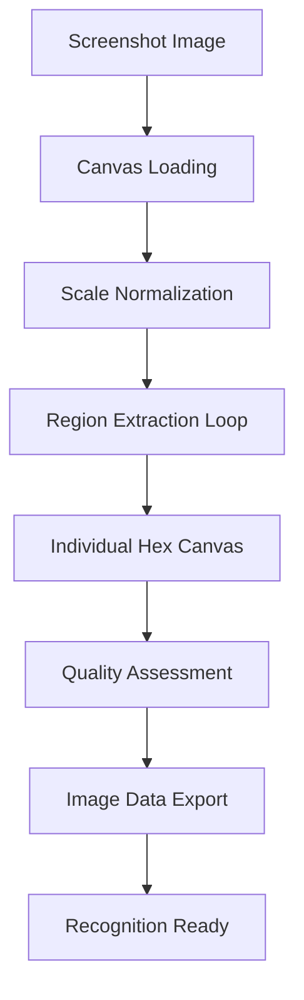

# Phase 3: Image Processing & Region Extraction

**Duration:** 4-5 days  
**Dependencies:** Phases 1-2 (File upload, coordinate mapping)  
**Output:** Extracted hex region images ready for recognition analysis

## 📋 Table of Contents
1. [Overview](#overview)
2. [Technical Architecture](#technical-architecture)
3. [Implementation Sub-Steps](#implementation-sub-steps)
4. [Library Analysis](#library-analysis)
5. [Code Implementation](#code-implementation)
6. [Performance Optimization](#performance-optimization)
7. [Testing Requirements](#testing-requirements)
8. [Risk Assessment](#risk-assessment)

---

## Overview

This phase implements efficient image processing to extract individual hex regions from screenshots based on coordinate mapping from Phase 2. The system must handle various image formats, resolutions, and quality levels while maintaining performance and accuracy.

### Success Criteria
- ✅ Extract 48x48px hex regions from any screenshot resolution
- ✅ Process 4K screenshots in under 3 seconds
- ✅ Maintain image quality for recognition accuracy
- ✅ Handle edge cases (partial hexes, overlays, poor quality)
- ✅ Memory-efficient processing (< 100MB peak usage)

### Input from Phase 2
```javascript
{
  type: 'grid-mapped',
  detail: {
    imageElement: HTMLImageElement,
    coordinateMap: Map<string, CoordinateData>,
    scalingFactor: number,
    boundingBox: Rectangle,
    confidence: number
  }
}
```

### Output for Phase 4
```javascript
{
  type: 'regions-extracted',
  detail: {
    regionData: Map<string, {
      modName: string,
      imageData: ImageData,
      canvas: HTMLCanvasElement,
      bounds: Rectangle,
      quality: number
    }>,
    processingMetadata: {
      totalRegions: number,
      processingTime: number,
      averageQuality: number,
      failedExtractions: string[]
    }
  }
}
```

---

## Technical Architecture

### Canvas Processing Pipeline



### Memory Management Strategy

```javascript
// Canvas pooling for memory efficiency
class CanvasPool {
  constructor(maxSize = 10) {
    this.pool = [];
    this.maxSize = maxSize;
  }
  
  getCanvas(width = 48, height = 48) {
    let canvas = this.pool.pop();
    if (!canvas) {
      canvas = document.createElement('canvas');
    }
    canvas.width = width;
    canvas.height = height;
    return canvas;
  }
  
  releaseCanvas(canvas) {
    if (this.pool.length < this.maxSize) {
      const ctx = canvas.getContext('2d');
      ctx.clearRect(0, 0, canvas.width, canvas.height);
      this.pool.push(canvas);
    }
  }
}
```

### Processing Optimization

- **Batch Processing:** Process multiple regions in parallel
- **Web Workers:** Offload heavy processing to background threads
- **Canvas Reuse:** Pool canvas elements to reduce garbage collection
- **Progressive Loading:** Process and display results incrementally

---

## Implementation Sub-Steps

### 3.1 Image Loading & Preparation

**Input:** ImageElement from Phase 2  
**Output:** Prepared canvas with normalized image  
**Files Created:** `docs/modules/image-processor.js`

#### Image Normalization Process
```javascript
class ImageProcessor {
  constructor() {
    this.canvasPool = new CanvasPool();
    this.workerPool = new WorkerPool(2); // 2 background workers
  }
  
  async prepareImage(imageElement, targetResolution = null) {
    const canvas = this.canvasPool.getCanvas(
      targetResolution?.width || imageElement.width,
      targetResolution?.height || imageElement.height
    );
    
    const ctx = canvas.getContext('2d');
    
    // Enable image smoothing for high-quality scaling
    ctx.imageSmoothingEnabled = true;
    ctx.imageSmoothingQuality = 'high';
    
    // Draw and potentially scale the image
    ctx.drawImage(
      imageElement,
      0, 0, imageElement.width, imageElement.height,
      0, 0, canvas.width, canvas.height
    );
    
    return {
      canvas,
      originalDimensions: { 
        width: imageElement.width, 
        height: imageElement.height 
      },
      processedDimensions: { 
        width: canvas.width, 
        height: canvas.height 
      }
    };
  }
}
```

#### Quality Assessment
```javascript
// Assess image quality for processing decisions
function assessImageQuality(imageData) {
  const { data, width, height } = imageData;
  let totalVariance = 0;
  let brightPixels = 0;
  
  // Calculate variance and brightness distribution
  for (let i = 0; i < data.length; i += 4) {
    const r = data[i];
    const g = data[i + 1];
    const b = data[i + 2];
    const brightness = (r + g + b) / 3;
    
    if (brightness > 128) brightPixels++;
    
    // Calculate local variance for sharpness assessment
    if (i + width * 4 < data.length) {
      const nextRowBrightness = (data[i + width * 4] + data[i + width * 4 + 1] + data[i + width * 4 + 2]) / 3;
      totalVariance += Math.abs(brightness - nextRowBrightness);
    }
  }
  
  return {
    sharpness: totalVariance / (width * height),
    brightness: brightPixels / (width * height / 4),
    quality: Math.min(1.0, (totalVariance / (width * height)) / 50) // Normalized quality score
  };
}
```

---

### 3.2 Region Extraction Engine

**Input:** Prepared canvas and coordinate map  
**Output:** Individual hex region canvases  
**Files Modified:** `docs/modules/image-processor.js`

#### Extraction Strategy
```javascript
class RegionExtractor {
  constructor(imageProcessor) {
    this.processor = imageProcessor;
    this.hexSize = 48; // Standard hex diameter
    this.extractionPadding = 4; // Extra pixels for edge detection
  }
  
  async extractAllRegions(canvas, coordinateMap) {
    const regionData = new Map();
    const failedExtractions = [];
    
    // Process regions in batches to avoid blocking UI
    const modNames = Array.from(coordinateMap.keys());
    const batchSize = 10;
    
    for (let i = 0; i < modNames.length; i += batchSize) {
      const batch = modNames.slice(i, i + batchSize);
      const batchPromises = batch.map(modName => 
        this.extractSingleRegion(canvas, coordinateMap.get(modName))
      );
      
      const batchResults = await Promise.allSettled(batchPromises);
      
      batch.forEach((modName, index) => {
        const result = batchResults[index];
        if (result.status === 'fulfilled') {
          regionData.set(modName, result.value);
        } else {
          failedExtractions.push(modName);
          console.warn(`Failed to extract region for ${modName}:`, result.reason);
        }
      });
      
      // Yield control to prevent blocking
      await new Promise(resolve => setTimeout(resolve, 0));
    }
    
    return { regionData, failedExtractions };
  }
  
  async extractSingleRegion(sourceCanvas, coordinateData) {
    const { transformedPixel } = coordinateData;
    const extractSize = this.hexSize + (this.extractionPadding * 2);
    
    // Calculate extraction bounds
    const bounds = {
      x: Math.max(0, transformedPixel.x - extractSize / 2),
      y: Math.max(0, transformedPixel.y - extractSize / 2),
      width: Math.min(extractSize, sourceCanvas.width - (transformedPixel.x - extractSize / 2)),
      height: Math.min(extractSize, sourceCanvas.height - (transformedPixel.y - extractSize / 2))
    };
    
    // Create region canvas
    const regionCanvas = this.processor.canvasPool.getCanvas(this.hexSize, this.hexSize);
    const regionCtx = regionCanvas.getContext('2d');
    
    // Extract and center the region
    const sourceCtx = sourceCanvas.getContext('2d');
    const sourceImageData = sourceCtx.getImageData(bounds.x, bounds.y, bounds.width, bounds.height);
    
    // Center the extracted region in the output canvas
    const offsetX = (this.hexSize - bounds.width) / 2;
    const offsetY = (this.hexSize - bounds.height) / 2;
    
    regionCtx.putImageData(sourceImageData, offsetX, offsetY);
    
    // Assess region quality
    const regionImageData = regionCtx.getImageData(0, 0, this.hexSize, this.hexSize);
    const quality = assessImageQuality(regionImageData);
    
    return {
      modName: coordinateData.modData.className,
      imageData: regionImageData,
      canvas: regionCanvas,
      bounds,
      quality: quality.quality,
      metadata: {
        sharpness: quality.sharpness,
        brightness: quality.brightness,
        extractedAt: Date.now()
      }
    };
  }
}
```

---

### 3.3 Web Worker Integration

**Input:** Heavy processing tasks  
**Output:** Non-blocking background processing  
**Files Created:** `docs/workers/image-processing-worker.js`

#### Worker Implementation
```javascript
// image-processing-worker.js
self.onmessage = function(e) {
  const { type, data } = e.data;
  
  switch (type) {
    case 'extractRegions':
      handleRegionExtraction(data);
      break;
    case 'processQuality':
      handleQualityAssessment(data);
      break;
    default:
      console.warn('Unknown worker task:', type);
  }
};

function handleRegionExtraction({ imageData, coordinates, hexSize }) {
  const results = [];
  
  for (const coord of coordinates) {
    try {
      const region = extractRegionFromImageData(imageData, coord, hexSize);
      results.push({
        modName: coord.modName,
        success: true,
        regionData: region
      });
    } catch (error) {
      results.push({
        modName: coord.modName,
        success: false,
        error: error.message
      });
    }
  }
  
  self.postMessage({
    type: 'extractionComplete',
    results
  });
}

function extractRegionFromImageData(sourceImageData, coordinate, hexSize) {
  // Implement region extraction logic using ImageData
  const { width, height, data } = sourceImageData;
  const { x, y } = coordinate.transformedPixel;
  
  const regionData = new Uint8ClampedArray(hexSize * hexSize * 4);
  
  for (let ry = 0; ry < hexSize; ry++) {
    for (let rx = 0; rx < hexSize; rx++) {
      const sourceX = Math.floor(x - hexSize/2 + rx);
      const sourceY = Math.floor(y - hexSize/2 + ry);
      
      if (sourceX >= 0 && sourceX < width && sourceY >= 0 && sourceY < height) {
        const sourceIndex = (sourceY * width + sourceX) * 4;
        const targetIndex = (ry * hexSize + rx) * 4;
        
        regionData[targetIndex] = data[sourceIndex];         // R
        regionData[targetIndex + 1] = data[sourceIndex + 1]; // G
        regionData[targetIndex + 2] = data[sourceIndex + 2]; // B
        regionData[targetIndex + 3] = data[sourceIndex + 3]; // A
      }
    }
  }
  
  return new ImageData(regionData, hexSize, hexSize);
}
```

#### Worker Pool Management
```javascript
class WorkerPool {
  constructor(size = 2) {
    this.workers = [];
    this.queue = [];
    this.activeJobs = 0;
    
    for (let i = 0; i < size; i++) {
      this.workers.push(this.createWorker());
    }
  }
  
  createWorker() {
    const worker = new Worker('workers/image-processing-worker.js');
    worker.onmessage = (e) => this.handleWorkerMessage(worker, e);
    return { worker, busy: false };
  }
  
  async processTask(type, data) {
    return new Promise((resolve, reject) => {
      this.queue.push({ type, data, resolve, reject });
      this.processQueue();
    });
  }
  
  processQueue() {
    if (this.queue.length === 0) return;
    
    const availableWorker = this.workers.find(w => !w.busy);
    if (!availableWorker) return;
    
    const task = this.queue.shift();
    availableWorker.busy = true;
    availableWorker.currentTask = task;
    
    availableWorker.worker.postMessage({
      type: task.type,
      data: task.data
    });
  }
  
  handleWorkerMessage(worker, event) {
    const workerInfo = this.workers.find(w => w.worker === worker);
    if (!workerInfo || !workerInfo.currentTask) return;
    
    const task = workerInfo.currentTask;
    workerInfo.busy = false;
    workerInfo.currentTask = null;
    
    task.resolve(event.data);
    this.processQueue();
  }
}
```

---

## Library Analysis

### Option 1: Native Canvas API (Recommended)
**Pros:**
- Zero additional dependencies
- Maximum performance and control
- Direct ImageData manipulation
- Wide browser support

**Cons:**
- More implementation complexity
- Manual optimization required
- Limited built-in image processing functions

**Code Example:**
```javascript
// Native canvas region extraction
function extractRegionNative(sourceCanvas, x, y, size) {
  const ctx = sourceCanvas.getContext('2d');
  const imageData = ctx.getImageData(x - size/2, y - size/2, size, size);
  
  const regionCanvas = document.createElement('canvas');
  regionCanvas.width = size;
  regionCanvas.height = size;
  const regionCtx = regionCanvas.getContext('2d');
  regionCtx.putImageData(imageData, 0, 0);
  
  return regionCanvas;
}
```

### Option 2: Jimp.js
**Repository:** [jimp-dev/jimp](https://github.com/jimp-dev/jimp)  
**Bundle Size:** ~380KB minified  

**Pros:**
- Rich image processing API
- Built-in quality enhancement
- Good documentation and community
- Works in browser and Node.js

**Cons:**
- Large bundle size
- Async-heavy API may affect performance
- Overkill for simple region extraction

**Code Example:**
```javascript
import Jimp from 'jimp';

async function extractRegionJimp(imageBuffer, x, y, size) {
  const image = await Jimp.read(imageBuffer);
  const region = image.crop(x - size/2, y - size/2, size, size);
  return region.getBufferAsync(Jimp.MIME_PNG);
}
```

### Option 3: Fabric.js (For Advanced Features)
**Repository:** [fabricjs/fabric.js](https://github.com/fabricjs/fabric.js)  
**Bundle Size:** ~520KB minified  

**Pros:**
- Advanced canvas manipulation
- Built-in filtering and effects
- Good for interactive processing
- Extensive transformation options

**Cons:**
- Very large bundle size
- Complex API for simple tasks
- Designed for interactive graphics, not batch processing

**Recommendation:** Use Native Canvas API for optimal performance and minimal dependencies, with Jimp as a fallback for complex image processing needs.

---

## Code Implementation

### Core Image Processing Module

**File:** `docs/modules/image-processor.js`

```javascript
/**
 * Image Processing Engine
 * Handles screenshot processing and hex region extraction
 */
class ImageProcessor {
  constructor(options = {}) {
    this.options = {
      hexSize: 48,
      extractionPadding: 4,
      qualityThreshold: 0.3,
      workerCount: navigator.hardwareConcurrency || 2,
      ...options
    };
    
    this.canvasPool = new CanvasPool(20);
    this.workerPool = new WorkerPool(this.options.workerCount);
    this.regionExtractor = new RegionExtractor(this);
    
    this.processingStats = {
      totalProcessed: 0,
      averageTime: 0,
      memoryPeak: 0
    };
  }
  
  async processScreenshot(gridMappedData) {
    const startTime = performance.now();
    const initialMemory = this.getMemoryUsage();
    
    try {
      // Prepare main canvas
      const preparedImage = await this.prepareImage(
        gridMappedData.imageElement,
        this.calculateOptimalResolution(gridMappedData)
      );
      
      // Extract all hex regions
      const extraction = await this.regionExtractor.extractAllRegions(
        preparedImage.canvas,
        gridMappedData.coordinateMap
      );
      
      // Quality filtering
      const filteredRegions = this.filterRegionsByQuality(
        extraction.regionData,
        this.options.qualityThreshold
      );
      
      // Update processing statistics
      const processingTime = performance.now() - startTime;
      this.updateProcessingStats(processingTime, this.getMemoryUsage() - initialMemory);
      
      // Emit results to Phase 4
      this.emitRegionsExtracted(filteredRegions, extraction.failedExtractions, {
        processingTime,
        totalRegions: filteredRegions.size,
        averageQuality: this.calculateAverageQuality(filteredRegions),
        failedExtractions: extraction.failedExtractions
      });
      
      // Cleanup
      this.canvasPool.releaseCanvas(preparedImage.canvas);
      
    } catch (error) {
      this.handleProcessingError(error);
    }
  }
  
  calculateOptimalResolution(gridMappedData) {
    const { imageElement, scalingFactor } = gridMappedData;
    
    // For very large images, scale down to improve performance
    if (imageElement.width > 3840 || imageElement.height > 2160) {
      const maxDimension = Math.max(imageElement.width, imageElement.height);
      const scaleFactor = 3840 / maxDimension;
      
      return {
        width: Math.floor(imageElement.width * scaleFactor),
        height: Math.floor(imageElement.height * scaleFactor)
      };
    }
    
    return null; // Use original resolution
  }
  
  filterRegionsByQuality(regionData, threshold) {
    const filtered = new Map();
    
    for (const [modName, region] of regionData) {
      if (region.quality >= threshold) {
        filtered.set(modName, region);
      } else {
        console.warn(`Region ${modName} filtered out due to low quality: ${region.quality}`);
      }
    }
    
    return filtered;
  }
  
  calculateAverageQuality(regionData) {
    if (regionData.size === 0) return 0;
    
    const totalQuality = Array.from(regionData.values())
      .reduce((sum, region) => sum + region.quality, 0);
    
    return totalQuality / regionData.size;
  }
  
  emitRegionsExtracted(regionData, failedExtractions, metadata) {
    const event = new CustomEvent('regions-extracted', {
      detail: {
        regionData,
        processingMetadata: metadata
      }
    });
    
    document.dispatchEvent(event);
  }
  
  getMemoryUsage() {
    return performance.memory?.usedJSHeapSize || 0;
  }
  
  updateProcessingStats(processingTime, memoryDelta) {
    this.processingStats.totalProcessed++;
    this.processingStats.averageTime = 
      (this.processingStats.averageTime * (this.processingStats.totalProcessed - 1) + processingTime) / 
      this.processingStats.totalProcessed;
    this.processingStats.memoryPeak = Math.max(this.processingStats.memoryPeak, memoryDelta);
  }
  
  handleProcessingError(error) {
    console.error('Image processing failed:', error);
    
    const errorEvent = new CustomEvent('image-processing-error', {
      detail: {
        error: error.message,
        code: error.code || 'PROCESSING_FAILED',
        timestamp: Date.now()
      }
    });
    
    document.dispatchEvent(errorEvent);
  }
}
```

### Performance Optimization Module

**File:** `docs/modules/performance-optimizer.js`

```javascript
/**
 * Performance Optimization Utilities
 * Handles memory management and processing optimization
 */
class PerformanceOptimizer {
  constructor() {
    this.memoryThreshold = 100 * 1024 * 1024; // 100MB
    this.frameTimeThreshold = 16; // 16ms for 60fps
    this.isOptimizing = false;
  }
  
  async optimizeProcessing(processingFunc, data) {
    const chunks = this.chunkData(data, this.calculateOptimalChunkSize());
    const results = [];
    
    for (const chunk of chunks) {
      const chunkResult = await this.processChunkWithThrottling(processingFunc, chunk);
      results.push(...chunkResult);
      
      // Yield control and check memory
      await this.yieldAndCheckMemory();
    }
    
    return results;
  }
  
  calculateOptimalChunkSize() {
    const availableMemory = this.getAvailableMemory();
    const estimatedItemSize = 48 * 48 * 4; // 48x48 RGBA
    
    return Math.min(20, Math.floor(availableMemory / (estimatedItemSize * 10)));
  }
  
  async processChunkWithThrottling(processingFunc, chunk) {
    const startTime = performance.now();
    const result = await processingFunc(chunk);
    const processingTime = performance.now() - startTime;
    
    // If processing took too long, add delay to prevent blocking
    if (processingTime > this.frameTimeThreshold) {
      await new Promise(resolve => setTimeout(resolve, Math.min(processingTime / 2, 50)));
    }
    
    return result;
  }
  
  async yieldAndCheckMemory() {
    // Yield control to browser
    await new Promise(resolve => requestAnimationFrame(resolve));
    
    // Check memory usage
    const memoryUsage = this.getCurrentMemoryUsage();
    if (memoryUsage > this.memoryThreshold) {
      console.warn('High memory usage detected, triggering garbage collection hint');
      this.suggestGarbageCollection();
      await new Promise(resolve => setTimeout(resolve, 100));
    }
  }
  
  getCurrentMemoryUsage() {
    return performance.memory?.usedJSHeapSize || 0;
  }
  
  getAvailableMemory() {
    const totalMemory = performance.memory?.jsHeapSizeLimit || (1024 * 1024 * 1024);
    const usedMemory = this.getCurrentMemoryUsage();
    return totalMemory - usedMemory;
  }
  
  suggestGarbageCollection() {
    // Force garbage collection hint (Chrome only)
    if (window.gc) {
      window.gc();
    }
  }
  
  chunkData(data, chunkSize) {
    const chunks = [];
    const items = Array.isArray(data) ? data : Array.from(data);
    
    for (let i = 0; i < items.length; i += chunkSize) {
      chunks.push(items.slice(i, i + chunkSize));
    }
    
    return chunks;
  }
}
```

---

## Performance Optimization

### Memory Management Strategies

1. **Canvas Pooling**
   ```javascript
   // Reuse canvas elements to reduce GC pressure
   const canvasPool = new CanvasPool(20);
   ```

2. **Progressive Processing**
   ```javascript
   // Process regions in batches to maintain responsiveness
   for (let i = 0; i < regions.length; i += batchSize) {
     await processBatch(regions.slice(i, i + batchSize));
     await new Promise(resolve => setTimeout(resolve, 0));
   }
   ```

3. **Worker Utilization**
   ```javascript
   // Distribute heavy processing across Web Workers
   const workerPool = new WorkerPool(navigator.hardwareConcurrency);
   ```

### Processing Optimizations

1. **Resolution Scaling**
   - Automatically scale down very large images
   - Maintain quality while improving performance
   - Target 2K maximum processing resolution

2. **Region Prioritization**
   - Process center regions first (more likely to be visible)
   - Skip regions outside detected boundaries
   - Early termination for obviously empty regions

3. **Quality-based Filtering**
   - Skip low-quality regions that won't provide good recognition
   - Adjust quality thresholds based on overall image quality
   - Provide feedback on skipped regions

---

## Testing Requirements

### 3.1 Unit Tests

**File:** `tests/unit/image-processor.test.js`

```javascript
import { describe, it, expect, beforeEach } from 'vitest';
import { ImageProcessor } from '../docs/modules/image-processor.js';

describe('ImageProcessor', () => {
  let processor;
  
  beforeEach(() => {
    processor = new ImageProcessor();
  });
  
  it('should extract regions with correct dimensions', async () => {
    const mockCanvas = createMockCanvas(1920, 1080);
    const mockCoordinateMap = createMockCoordinateMap();
    
    const result = await processor.regionExtractor.extractAllRegions(
      mockCanvas, 
      mockCoordinateMap
    );
    
    expect(result.regionData.size).toBeGreaterThan(0);
    
    for (const [modName, region] of result.regionData) {
      expect(region.canvas.width).toBe(48);
      expect(region.canvas.height).toBe(48);
      expect(region.imageData.width).toBe(48);
      expect(region.imageData.height).toBe(48);
    }
  });
  
  it('should maintain performance within acceptable limits', async () => {
    const largeCanvas = createMockCanvas(3840, 2160);
    const largeCoordinateMap = createLargeCoordinateMap(50);
    
    const startTime = performance.now();
    const startMemory = performance.memory?.usedJSHeapSize || 0;
    
    await processor.regionExtractor.extractAllRegions(largeCanvas, largeCoordinateMap);
    
    const processingTime = performance.now() - startTime;
    const memoryIncrease = (performance.memory?.usedJSHeapSize || 0) - startMemory;
    
    expect(processingTime).toBeLessThan(5000); // < 5 seconds
    expect(memoryIncrease).toBeLessThan(100 * 1024 * 1024); // < 100MB
  });
});
```

### 3.2 Visual Quality Tests

```javascript
describe('Region Quality Assessment', () => {
  it('should accurately assess image sharpness', () => {
    const sharpRegion = createSharpTestRegion();
    const blurryRegion = createBlurryTestRegion();
    
    const sharpQuality = assessImageQuality(sharpRegion);
    const blurryQuality = assessImageQuality(blurryRegion);
    
    expect(sharpQuality.sharpness).toBeGreaterThan(blurryQuality.sharpness);
    expect(sharpQuality.quality).toBeGreaterThan(blurryQuality.quality);
  });
  
  it('should handle edge cases gracefully', () => {
    const emptyRegion = createEmptyRegion(48, 48);
    const noiseRegion = createNoiseRegion(48, 48);
    
    expect(() => assessImageQuality(emptyRegion)).not.toThrow();
    expect(() => assessImageQuality(noiseRegion)).not.toThrow();
  });
});
```

### 3.3 Performance Benchmarks

```javascript
describe('Performance Benchmarks', () => {
  const testCases = [
    { resolution: '1920x1080', regions: 30 },
    { resolution: '2560x1440', regions: 30 },
    { resolution: '3840x2160', regions: 30 }
  ];
  
  testCases.forEach(testCase => {
    it(`should process ${testCase.resolution} within time limits`, async () => {
      const canvas = createMockCanvas(...testCase.resolution.split('x').map(Number));
      const coordinateMap = createMockCoordinateMap(testCase.regions);
      
      const startTime = performance.now();
      await processor.processScreenshot({ imageElement: canvas, coordinateMap });
      const processingTime = performance.now() - startTime;
      
      const expectedMaxTime = testCase.resolution === '3840x2160' ? 5000 : 3000;
      expect(processingTime).toBeLessThan(expectedMaxTime);
    });
  });
});
```

---

## Risk Assessment

### High Risk Issues

#### Memory Overflow with Large Images
**Risk:** 4K+ screenshots causing browser memory exhaustion  
**Likelihood:** Medium  
**Impact:** High  

**Mitigation:**
```javascript
// Automatic image scaling for large screenshots
function scaleImageIfNeeded(imageElement) {
  const maxPixels = 3840 * 2160; // 4K limit
  const currentPixels = imageElement.width * imageElement.height;
  
  if (currentPixels > maxPixels) {
    const scaleFactor = Math.sqrt(maxPixels / currentPixels);
    return {
      width: Math.floor(imageElement.width * scaleFactor),
      height: Math.floor(imageElement.height * scaleFactor)
    };
  }
  
  return null; // No scaling needed
}
```

#### Canvas Context Loss
**Risk:** WebGL context loss causing processing failures  
**Likelihood:** Low  
**Impact:** High  

**Mitigation:**
```javascript
// Context loss detection and recovery
canvas.addEventListener('webglcontextlost', (event) => {
  event.preventDefault();
  console.warn('WebGL context lost, falling back to 2D canvas');
  this.fallbackTo2DContext();
});

canvas.addEventListener('webglcontextrestored', () => {
  console.log('WebGL context restored');
  this.reinitializeProcessing();
});
```

### Medium Risk Issues

#### Processing Performance on Low-End Devices
**Risk:** Poor performance on older devices/browsers  
**Mitigation:**
- Device capability detection
- Adaptive processing strategies
- Graceful degradation options

#### Region Extraction Accuracy
**Risk:** Imprecise coordinate mapping leading to poor extractions  
**Mitigation:**
- Quality assessment and filtering
- Multiple extraction attempts with slight variations
- User feedback integration for correction

---

## Implementation Checklist

### Phase 3.1: Core Processing Engine
- [ ] Implement ImageProcessor class with canvas pooling
- [ ] Create RegionExtractor with batch processing
- [ ] Add quality assessment algorithms
- [ ] Implement memory management strategies
- [ ] Test with various image resolutions
- [ ] Optimize for performance targets
- [ ] Add comprehensive error handling

### Phase 3.2: Web Worker Integration
- [ ] Create image processing worker script
- [ ] Implement WorkerPool management
- [ ] Add task queue and job distribution
- [ ] Test parallel processing performance
- [ ] Handle worker failures gracefully
- [ ] Optimize worker communication overhead
- [ ] Add worker debugging capabilities

### Phase 3.3: Performance Optimization
- [ ] Implement automatic image scaling
- [ ] Add progressive processing with yield points
- [ ] Create memory usage monitoring
- [ ] Optimize canvas operations
- [ ] Add performance benchmarking
- [ ] Test on various device capabilities
- [ ] Document performance characteristics

### Phase 3.4: Integration & Testing
- [ ] Integrate with Phase 2 event system
- [ ] Implement Phase 4 event emission
- [ ] Write comprehensive unit tests
- [ ] Create visual quality validation tests
- [ ] Benchmark performance across devices
- [ ] Test memory usage patterns
- [ ] Document API and processing pipeline
- [ ] Create debugging and visualization tools

---

## Phase 3 Outputs

### Data Outputs for Phase 4
```javascript
{
  type: 'regions-extracted',
  detail: {
    regionData: Map<string, {
      modName: string,
      imageData: ImageData,      // 48x48 RGBA data
      canvas: HTMLCanvasElement, // Rendered region
      bounds: Rectangle,         // Original extraction bounds
      quality: number,           // Quality score 0-1
      metadata: {
        sharpness: number,
        brightness: number,
        extractedAt: number
      }
    }>,
    processingMetadata: {
      totalRegions: number,
      processingTime: number,
      averageQuality: number,
      failedExtractions: string[]
    }
  }
}
```

### Files Created/Modified
- ✅ `docs/modules/image-processor.js` - Core processing engine
- ✅ `docs/modules/region-extractor.js` - Region extraction logic
- ✅ `docs/modules/performance-optimizer.js` - Performance utilities
- ✅ `docs/workers/image-processing-worker.js` - Web Worker implementation
- ✅ `tests/unit/image-processor.test.js` - Unit tests
- ✅ `tests/performance/processing-benchmarks.test.js` - Performance tests

### Integration Points for Phase 4
- **Event System:** `regions-extracted` event with image data
- **Performance:** Optimized image data ready for analysis
- **Quality Metrics:** Quality scores for recognition confidence
- **Error Handling:** Detailed failure information for debugging

---

**Next Phase:** [Phase 4: Recognition Logic & Selection Detection](Phase4-Recognition.md)
