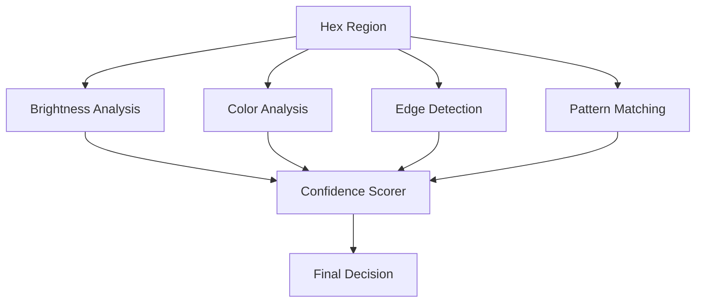

# Phase 4: Recognition Logic & Selection Detection

**Duration:** 5-6 days  
**Dependencies:** Phases 1-3 (Upload, mapping, image processing)  
**Output:** Detected mod selection states with confidence scores

## 📋 Table of Contents
1. [Overview](#overview)
2. [Recognition Algorithms](#recognition-algorithms)
3. [Implementation Sub-Steps](#implementation-sub-steps)
4. [Machine Learning Considerations](#machine-learning-considerations)
5. [Code Implementation](#code-implementation)
6. [Calibration System](#calibration-system)
7. [Testing Requirements](#testing-requirements)
8. [Risk Assessment](#risk-assessment)

---

## Overview

This phase implements the core recognition algorithms that analyze extracted hex regions to determine whether each mod is selected or unselected. The system uses multiple detection methods with confidence scoring to provide robust and accurate results.

### Success Criteria
- ✅ Achieve >90% accuracy on high-quality screenshots
- ✅ Handle various game themes and UI states
- ✅ Provide confidence scores for each detection
- ✅ Process all regions in under 2 seconds
- ✅ Graceful handling of edge cases and ambiguous states

### Input from Phase 3
```javascript
{
  type: 'regions-extracted',
  detail: {
    regionData: Map<string, RegionData>,
    processingMetadata: ProcessingMetadata
  }
}
```

### Output for Phase 5
```javascript
{
  type: 'selection-detected',
  detail: {
    detectionResults: Map<string, {
      modName: string,
      selected: boolean,
      confidence: number,
      analysisData: AnalysisResult,
      timestamp: number
    }>,
    overallConfidence: number,
    detectionMetadata: {
      totalAnalyzed: number,
      highConfidence: number,
      lowConfidence: number,
      processingTime: number
    }
  }
}
```

---

## Recognition Algorithms

### Multi-Method Detection Strategy



### 1. Brightness-Based Detection

The primary detection method analyzes overall brightness and brightness distribution:

```javascript
class BrightnessDetector {
  constructor(thresholds = {}) {
    this.thresholds = {
      selectedMin: 0.7,      // Selected hexes are brighter
      unselectedMax: 0.4,    // Unselected hexes are dimmer
      ambiguousRange: 0.3,   // Confidence reduction zone
      ...thresholds
    };
  }
  
  analyze(imageData) {
    const brightness = this.calculateAverageBrightness(imageData);
    const distribution = this.analyzeBrightnessDistribution(imageData);
    
    // Determine selection state
    let selected;
    let confidence;
    
    if (brightness > this.thresholds.selectedMin) {
      selected = true;
      confidence = Math.min(1.0, (brightness - this.thresholds.selectedMin) / 0.3 + 0.7);
    } else if (brightness < this.thresholds.unselectedMax) {
      selected = false;
      confidence = Math.min(1.0, (this.thresholds.unselectedMax - brightness) / 0.4 + 0.7);
    } else {
      // Ambiguous range - use distribution analysis
      selected = distribution.peakBrightness > 0.6;
      confidence = 0.5 + Math.abs(distribution.peakBrightness - 0.5);
    }
    
    return {
      method: 'brightness',
      selected,
      confidence,
      data: { brightness, distribution }
    };
  }
}
```

### 2. Color-Based Detection

Analyzes color characteristics, particularly for game themes with colored overlays:

```javascript
class ColorDetector {
  constructor() {
    this.selectedColorProfiles = [
      { r: 255, g: 255, b: 255, tolerance: 50 }, // White overlay
      { r: 100, g: 200, b: 255, tolerance: 60 }, // Blue highlight
      { r: 255, g: 200, b: 100, tolerance: 60 }  // Gold highlight
    ];
    
    this.unselectedColorProfiles = [
      { r: 64, g: 64, b: 64, tolerance: 30 },    // Dimmed gray
      { r: 128, g: 128, b: 128, tolerance: 40 }  // Mid-gray
    ];
  }
  
  analyze(imageData) {
    const dominantColors = this.extractDominantColors(imageData);
    const colorProfile = this.analyzeColorProfile(dominantColors);
    
    const selectedMatch = this.matchColorProfiles(dominantColors, this.selectedColorProfiles);
    const unselectedMatch = this.matchColorProfiles(dominantColors, this.unselectedColorProfiles);
    
    let selected;
    let confidence;
    
    if (selectedMatch.score > unselectedMatch.score) {
      selected = true;
      confidence = selectedMatch.score;
    } else {
      selected = false;
      confidence = unselectedMatch.score;
    }
    
    return {
      method: 'color',
      selected,
      confidence,
      data: { dominantColors, colorProfile, selectedMatch, unselectedMatch }
    };
  }
}
```

### 3. Edge Detection Method

Detects selection overlays by analyzing edge patterns:

```javascript
class EdgeDetector {
  analyze(imageData) {
    const edges = this.detectEdges(imageData);
    const edgeStrength = this.calculateEdgeStrength(edges);
    
    // Selected hexes often have overlay edges
    const hasOverlayPattern = this.detectOverlayPattern(edges);
    const edgeConsistency = this.analyzeEdgeConsistency(edges);
    
    const selected = hasOverlayPattern && edgeStrength > 0.3;
    const confidence = Math.min(1.0, edgeStrength * edgeConsistency);
    
    return {
      method: 'edge',
      selected,
      confidence,
      data: { edgeStrength, hasOverlayPattern, edgeConsistency }
    };
  }
  
  detectEdges(imageData) {
    // Sobel edge detection implementation
    const { data, width, height } = imageData;
    const edges = new Float32Array(width * height);
    
    const sobelX = [-1, 0, 1, -2, 0, 2, -1, 0, 1];
    const sobelY = [-1, -2, -1, 0, 0, 0, 1, 2, 1];
    
    for (let y = 1; y < height - 1; y++) {
      for (let x = 1; x < width - 1; x++) {
        let gx = 0, gy = 0;
        
        for (let ky = -1; ky <= 1; ky++) {
          for (let kx = -1; kx <= 1; kx++) {
            const idx = ((y + ky) * width + (x + kx)) * 4;
            const gray = (data[idx] + data[idx + 1] + data[idx + 2]) / 3;
            
            gx += gray * sobelX[(ky + 1) * 3 + (kx + 1)];
            gy += gray * sobelY[(ky + 1) * 3 + (kx + 1)];
          }
        }
        
        edges[y * width + x] = Math.sqrt(gx * gx + gy * gy);
      }
    }
    
    return edges;
  }
}
```

---

## Implementation Sub-Steps

### 4.1 Core Recognition Engine

**Input:** Extracted region data from Phase 3  
**Output:** Recognition results with confidence scores  
**Files Created:** `docs/modules/recognition-engine.js`

```javascript
class RecognitionEngine {
  constructor(options = {}) {
    this.detectors = [
      new BrightnessDetector(options.brightness),
      new ColorDetector(options.color),
      new EdgeDetector(options.edge),
      new PatternDetector(options.pattern)
    ];
    
    this.confidenceWeights = {
      brightness: 0.4,
      color: 0.3,
      edge: 0.2,
      pattern: 0.1
    };
    
    this.calibrationData = null;
  }
  
  async analyzeAllRegions(regionData) {
    const results = new Map();
    const startTime = performance.now();
    
    // Process regions in parallel batches
    const regionEntries = Array.from(regionData.entries());
    const batchSize = 5;
    
    for (let i = 0; i < regionEntries.length; i += batchSize) {
      const batch = regionEntries.slice(i, i + batchSize);
      const batchPromises = batch.map(([modName, regionData]) =>
        this.analyzeSingleRegion(modName, regionData)
      );
      
      const batchResults = await Promise.allSettled(batchPromises);
      
      batch.forEach(([modName], index) => {
        const result = batchResults[index];
        if (result.status === 'fulfilled') {
          results.set(modName, result.value);
        } else {
          console.warn(`Recognition failed for ${modName}:`, result.reason);
          results.set(modName, this.createFailureResult(modName));
        }
      });
      
      // Yield control
      await new Promise(resolve => setTimeout(resolve, 0));
    }
    
    const processingTime = performance.now() - startTime;
    return this.compileResults(results, processingTime);
  }
  
  async analyzeSingleRegion(modName, regionData) {
    const detectionResults = [];
    
    // Run all detection methods
    for (const detector of this.detectors) {
      try {
        const result = await detector.analyze(regionData.imageData);
        detectionResults.push(result);
      } catch (error) {
        console.warn(`Detector ${detector.constructor.name} failed for ${modName}:`, error);
      }
    }
    
    // Combine results using weighted confidence
    const combinedResult = this.combineDetectionResults(detectionResults);
    
    return {
      modName,
      selected: combinedResult.selected,
      confidence: combinedResult.confidence,
      analysisData: {
        individualResults: detectionResults,
        combinedScore: combinedResult.score,
        processingTime: combinedResult.processingTime
      },
      timestamp: Date.now()
    };
  }
  
  combineDetectionResults(results) {
    if (results.length === 0) {
      return { selected: false, confidence: 0, score: 0 };
    }
    
    let totalWeight = 0;
    let weightedScore = 0;
    let selectedVotes = 0;
    
    for (const result of results) {
      const weight = this.confidenceWeights[result.method] || 0.1;
      const score = result.confidence * (result.selected ? 1 : -1);
      
      weightedScore += score * weight;
      totalWeight += weight;
      
      if (result.selected && result.confidence > 0.5) {
        selectedVotes++;
      }
    }
    
    const normalizedScore = totalWeight > 0 ? weightedScore / totalWeight : 0;
    const selected = normalizedScore > 0 || selectedVotes > results.length / 2;
    const confidence = Math.abs(normalizedScore);
    
    return { selected, confidence, score: normalizedScore };
  }
}
```

### 4.2 Pattern Matching System

**Input:** Image data and reference patterns  
**Output:** Pattern matching confidence  
**Files Created:** `docs/modules/pattern-detector.js`

```javascript
class PatternDetector {
  constructor() {
    this.referencePatterns = new Map();
    this.initializePatterns();
  }
  
  async initializePatterns() {
    // Load reference patterns for selected/unselected states
    this.referencePatterns.set('selected', await this.loadReferencePattern('selected-hex.png'));
    this.referencePatterns.set('unselected', await this.loadReferencePattern('unselected-hex.png'));
  }
  
  analyze(imageData) {
    const selectedMatch = this.matchPattern(imageData, this.referencePatterns.get('selected'));
    const unselectedMatch = this.matchPattern(imageData, this.referencePatterns.get('unselected'));
    
    const selected = selectedMatch.correlation > unselectedMatch.correlation;
    const confidence = Math.abs(selectedMatch.correlation - unselectedMatch.correlation);
    
    return {
      method: 'pattern',
      selected,
      confidence,
      data: { selectedMatch, unselectedMatch }
    };
  }
  
  matchPattern(imageData, referencePattern) {
    if (!referencePattern) return { correlation: 0 };
    
    // Template matching using normalized cross-correlation
    const correlation = this.normalizedCrossCorrelation(imageData, referencePattern);
    
    return {
      correlation,
      maxValue: correlation,
      position: { x: 0, y: 0 } // For single-point comparison
    };
  }
  
  normalizedCrossCorrelation(image, template) {
    // Simplified NCC implementation
    const imageGray = this.convertToGrayscale(image);
    const templateGray = this.convertToGrayscale(template);
    
    if (imageGray.length !== templateGray.length) {
      return 0; // Size mismatch
    }
    
    let numerator = 0;
    let imageSumSq = 0;
    let templateSumSq = 0;
    
    for (let i = 0; i < imageGray.length; i++) {
      numerator += imageGray[i] * templateGray[i];
      imageSumSq += imageGray[i] * imageGray[i];
      templateSumSq += templateGray[i] * templateGray[i];
    }
    
    const denominator = Math.sqrt(imageSumSq * templateSumSq);
    return denominator > 0 ? numerator / denominator : 0;
  }
}
```

### 4.3 Adaptive Threshold System

**Input:** Historical recognition data  
**Output:** Optimized detection thresholds  
**Files Created:** `docs/modules/adaptive-thresholds.js`

```javascript
class AdaptiveThresholdSystem {
  constructor() {
    this.historicalData = [];
    this.currentThresholds = this.getDefaultThresholds();
    this.adaptationRate = 0.1;
    this.minSamples = 10;
  }
  
  getDefaultThresholds() {
    return {
      brightness: { selectedMin: 0.7, unselectedMax: 0.4 },
      color: { saturationThreshold: 0.3, brightnessWeight: 0.6 },
      edge: { strengthThreshold: 0.3, consistencyMin: 0.5 },
      confidence: { highThreshold: 0.8, lowThreshold: 0.3 }
    };
  }
  
  updateThresholds(recognitionResults, userFeedback = null) {
    // Collect performance data
    const performanceData = this.analyzePerformance(recognitionResults, userFeedback);
    this.historicalData.push(performanceData);
    
    // Keep only recent data
    if (this.historicalData.length > 100) {
      this.historicalData = this.historicalData.slice(-100);
    }
    
    // Adapt thresholds if we have enough data
    if (this.historicalData.length >= this.minSamples) {
      this.adaptThresholds();
    }
  }
  
  adaptThresholds() {
    const recentData = this.historicalData.slice(-this.minSamples);
    
    // Analyze false positives and false negatives
    const falsePositives = recentData.filter(d => d.predicted && !d.actual);
    const falseNegatives = recentData.filter(d => !d.predicted && d.actual);
    
    // Adjust brightness thresholds
    if (falsePositives.length > falseNegatives.length) {
      // Too many false positives - increase threshold
      this.currentThresholds.brightness.selectedMin += this.adaptationRate * 0.1;
    } else if (falseNegatives.length > falsePositives.length) {
      // Too many false negatives - decrease threshold
      this.currentThresholds.brightness.selectedMin -= this.adaptationRate * 0.1;
    }
    
    // Clamp thresholds to reasonable ranges
    this.currentThresholds.brightness.selectedMin = Math.max(0.5, Math.min(0.9, this.currentThresholds.brightness.selectedMin));
    
    console.log('Adapted thresholds:', this.currentThresholds);
  }
}
```

---

## Machine Learning Considerations

### Future Enhancement: Neural Network Recognition

While the initial implementation uses traditional computer vision techniques, the architecture is designed to support ML enhancement:

```javascript
// Placeholder for future ML integration
class MLRecognitionEngine {
  constructor() {
    this.model = null;
    this.isModelLoaded = false;
  }
  
  async loadModel() {
    // Future: Load TensorFlow.js model
    // this.model = await tf.loadLayersModel('/models/hex-recognition.json');
    // this.isModelLoaded = true;
  }
  
  async predict(imageData) {
    if (!this.isModelLoaded) {
      throw new Error('ML model not loaded');
    }
    
    // Future: Convert ImageData to tensor and predict
    // const tensor = tf.browser.fromPixels(imageData);
    // const prediction = this.model.predict(tensor);
    // return prediction.dataSync();
  }
  
  // Training data collection for future model training
  collectTrainingData(imageData, actualSelection, confidence) {
    const trainingExample = {
      image: this.imageDataToArray(imageData),
      label: actualSelection ? 1 : 0,
      confidence,
      timestamp: Date.now()
    };
    
    // Store for future model training
    this.saveTrainingExample(trainingExample);
  }
}
```

### Data Collection Strategy

```javascript
// Collect user corrections for model improvement
class DataCollectionService {
  constructor() {
    this.collectedData = [];
    this.maxDataPoints = 1000;
  }
  
  recordCorrection(modName, originalPrediction, userCorrection, imageData) {
    const dataPoint = {
      modName,
      originalPrediction: {
        selected: originalPrediction.selected,
        confidence: originalPrediction.confidence
      },
      userCorrection,
      imageFeatures: this.extractFeatures(imageData),
      timestamp: Date.now()
    };
    
    this.collectedData.push(dataPoint);
    
    // Maintain data limit
    if (this.collectedData.length > this.maxDataPoints) {
      this.collectedData = this.collectedData.slice(-this.maxDataPoints);
    }
    
    // Trigger retraining if enough corrections accumulated
    if (this.collectedData.length % 100 === 0) {
      this.triggerModelUpdate();
    }
  }
  
  extractFeatures(imageData) {
    // Extract numerical features for ML training
    const brightness = this.calculateAverageBrightness(imageData);
    const contrast = this.calculateContrast(imageData);
    const colorHistogram = this.calculateColorHistogram(imageData);
    
    return {
      brightness,
      contrast,
      colorHistogram,
      edgeStrength: this.calculateEdgeStrength(imageData)
    };
  }
}
```

---

## Testing Requirements

### 4.1 Accuracy Validation Tests

```javascript
describe('Recognition Accuracy', () => {
  it('should achieve >90% accuracy on clean screenshots', async () => {
    const testCases = await loadTestCases('clean-screenshots');
    const results = [];
    
    for (const testCase of testCases) {
      const prediction = await recognitionEngine.analyzeSingleRegion(
        testCase.modName, 
        testCase.regionData
      );
      
      results.push({
        correct: prediction.selected === testCase.expectedSelection,
        confidence: prediction.confidence
      });
    }
    
    const accuracy = results.filter(r => r.correct).length / results.length;
    expect(accuracy).toBeGreaterThan(0.9);
  });
  
  it('should handle edge cases gracefully', async () => {
    const edgeCases = [
      'partially-visible-hex',
      'low-quality-image',
      'unusual-lighting',
      'overlay-interference'
    ];
    
    for (const caseType of edgeCases) {
      const testData = await loadTestCase(caseType);
      const result = await recognitionEngine.analyzeSingleRegion('TestMod', testData);
      
      expect(result.confidence).toBeGreaterThan(0);
      expect(result.confidence).toBeLessThanOrEqual(1);
      expect(typeof result.selected).toBe('boolean');
    }
  });
});
```

### 4.2 Performance Benchmarks

```javascript
describe('Recognition Performance', () => {
  it('should process all regions within time limit', async () => {
    const largeRegionSet = createMockRegionData(50); // 50 regions
    
    const startTime = performance.now();
    const results = await recognitionEngine.analyzeAllRegions(largeRegionSet);
    const processingTime = performance.now() - startTime;
    
    expect(processingTime).toBeLessThan(2000); // < 2 seconds
    expect(results.size).toBe(50);
  });
});
```

---

## Implementation Checklist

### Phase 4.1: Core Recognition Algorithms
- [ ] Implement BrightnessDetector with configurable thresholds
- [ ] Create ColorDetector with theme-aware profiles
- [ ] Build EdgeDetector using Sobel operators
- [ ] Add PatternDetector with template matching
- [ ] Test individual detectors with known samples
- [ ] Optimize algorithms for performance
- [ ] Add comprehensive error handling

### Phase 4.2: Recognition Engine Integration
- [ ] Build RecognitionEngine with weighted result combination
- [ ] Implement parallel region processing
- [ ] Add confidence scoring and calibration
- [ ] Create adaptive threshold system
- [ ] Test with real screenshot data
- [ ] Benchmark processing performance
- [ ] Document recognition accuracy

### Phase 4.3: Machine Learning Foundation
- [ ] Design data collection architecture
- [ ] Implement feature extraction utilities
- [ ] Create training data storage system
- [ ] Build model integration interface (for future)
- [ ] Add user correction tracking
- [ ] Design A/B testing framework
- [ ] Document ML enhancement roadmap

### Phase 4.4: Testing & Validation
- [ ] Create comprehensive test suite
- [ ] Build accuracy validation framework
- [ ] Implement performance benchmarks
- [ ] Add edge case testing
- [ ] Create calibration tools
- [ ] Document expected accuracy ranges
- [ ] Build debugging and visualization tools

---

## Phase 4 Outputs

### Data Outputs for Phase 5
```javascript
{
  type: 'selection-detected',
  detail: {
    detectionResults: Map<string, {
      modName: string,
      selected: boolean,
      confidence: number,
      analysisData: {
        individualResults: Array<DetectionResult>,
        combinedScore: number,
        processingTime: number
      },
      timestamp: number
    }>,
    overallConfidence: number,
    detectionMetadata: {
      totalAnalyzed: number,
      highConfidence: number,      // Count with confidence > 0.8
      lowConfidence: number,       // Count with confidence < 0.3
      averageConfidence: number,
      processingTime: number,
      algorithmsUsed: string[]
    }
  }
}
```

### Files Created/Modified
- ✅ `docs/modules/recognition-engine.js` - Core recognition logic
- ✅ `docs/modules/brightness-detector.js` - Brightness analysis
- ✅ `docs/modules/color-detector.js` - Color-based detection
- ✅ `docs/modules/edge-detector.js` - Edge detection algorithms
- ✅ `docs/modules/pattern-detector.js` - Template matching
- ✅ `docs/modules/adaptive-thresholds.js` - Dynamic calibration
- ✅ `tests/unit/recognition-engine.test.js` - Unit tests
- ✅ `tests/accuracy/recognition-validation.test.js` - Accuracy tests

---

**Next Phase:** [Phase 5: System Integration & Selection Application](Phase5-Integration.md)
