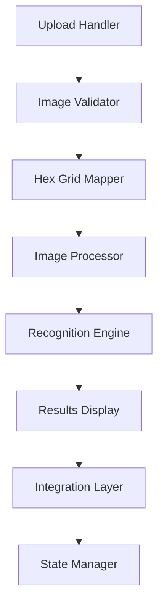

# Phase 8: Documentation & Deployment

**Duration:** 2-3 days  
**Dependencies:** Phases 1-7 (Complete implementation and testing)  
**Output:** Comprehensive documentation, deployment guide, and user onboarding materials

## 📋 Table of Contents
1. [Overview](#overview)
2. [Documentation Strategy](#documentation-strategy)
3. [Implementation Sub-Steps](#implementation-sub-steps)
4. [Content Development](#content-development)
5. [Deployment Preparation](#deployment-preparation)
6. [User Onboarding](#user-onboarding)
7. [Maintenance Documentation](#maintenance-documentation)
8. [Success Metrics](#success-metrics)

---

## Overview

This final phase creates comprehensive documentation covering user guides, technical documentation, API references, troubleshooting guides, and deployment procedures. The goal is to ensure smooth adoption and long-term maintainability of the screenshot recognition feature.

### Success Criteria
- ✅ Complete user guide with screenshots and step-by-step instructions
- ✅ Technical documentation for developers and maintainers
- ✅ API documentation for all modules and functions
- ✅ Deployment guide with rollback procedures
- ✅ Troubleshooting guide with common issues and solutions
- ✅ Performance monitoring and maintenance procedures

---

## Documentation Strategy

### Target Audiences
| Audience | Documentation Type | Priority | Format |
|----------|-------------------|----------|---------|
| End Users | User Guide, FAQ | High | Interactive HTML + Video |
| Developers | API Docs, Architecture | High | Markdown + JSDoc |
| Maintainers | Troubleshooting, Deployment | Medium | Markdown + Scripts |
| Contributors | Contributing Guide | Medium | Markdown |

### Content Hierarchy
```
documentation/
├── user-guide/
│   ├── getting-started.md          # Quick start guide
│   ├── uploading-screenshots.md    # Image upload tutorial
│   ├── reviewing-results.md        # Results review process
│   ├── troubleshooting.md          # Common user issues
│   └── accessibility.md            # Accessibility features
├── technical/
│   ├── architecture.md             # System architecture
│   ├── api-reference.md            # Complete API docs
│   ├── integration-guide.md        # Adding new features
│   ├── performance.md              # Performance considerations
│   └── testing-guide.md            # Testing procedures
├── deployment/
│   ├── setup-guide.md              # Initial deployment
│   ├── update-procedures.md        # Version updates
│   ├── rollback-guide.md           # Emergency rollback
│   ├── monitoring.md               # Performance monitoring
│   └── backup-procedures.md        # Data backup strategies
└── assets/
    ├── screenshots/                # Tutorial screenshots
    ├── diagrams/                   # Architecture diagrams
    ├── videos/                     # Tutorial videos
    └── templates/                  # Documentation templates
```

---

## Implementation Sub-Steps

### 8.1 User Documentation Creation

**Duration:** 1 day  
**Responsible:** Technical writer + UX designer  
**Files:** `docs/user-guide/`

#### 8.1.1 Getting Started Guide
```markdown
# Getting Started with Screenshot Recognition

## What You Need
- A screenshot of your Nova Drift mod selection screen
- A modern web browser (Chrome 90+, Firefox 90+, Safari 14+)
- Image file in PNG or JPG format (max 10MB)

## Quick Start (2 minutes)
1. Open the Nova Drift Cheatsheet
2. Click the "Upload Screenshot" button in the toolbar
3. Select or drag your screenshot file
4. Review the detected selections
5. Make any necessary corrections
6. Click "Apply to Cheatsheet"

## Detailed Tutorial
[Step-by-step guide with screenshots]
```

#### 8.1.2 Troubleshooting Guide
```markdown
# Common Issues and Solutions

## Upload Problems
**Problem:** File won't upload
- Check file size (must be under 10MB)
- Verify file format (PNG or JPG only)
- Try a different browser

**Problem:** Upload is slow
- Large files take longer to process
- Check your internet connection
- Try compressing the image

## Recognition Issues
**Problem:** Selections not detected correctly
- Ensure screenshot shows full mod selection area
- Check image quality and resolution
- Use screenshots from default UI scale
- Avoid cropped or partial screenshots

**Problem:** Poor detection accuracy
- Take screenshot at 1920x1080 or higher
- Ensure mod icons are clearly visible
- Avoid screenshots with overlays or effects
```

#### Deliverables:
- [ ] Getting started guide with screenshots
- [ ] Step-by-step tutorial with video walkthrough
- [ ] FAQ section with common questions
- [ ] Troubleshooting guide with solutions
- [ ] Accessibility guide for screen reader users

#### Testing:
- [ ] User testing with non-technical users
- [ ] Documentation review by team members
- [ ] Accessibility testing with screen readers
- [ ] Cross-browser documentation testing

### 8.2 Technical Documentation

**Duration:** 1 day  
**Responsible:** Lead developer  
**Files:** `docs/technical/`

#### 8.2.1 API Reference Generation
```javascript
/**
 * Automated API documentation generation using JSDoc
 */
const jsDocConfig = {
  source: {
    include: ['./docs/modules/'],
    exclude: ['./docs/modules/tests/']
  },
  opts: {
    destination: './docs/technical/api/'
  },
  plugins: ['plugins/markdown'],
  templates: {
    cleverLinks: false,
    monospaceLinks: false
  }
};
```

#### 8.2.2 Architecture Documentation
```markdown
# System Architecture

## High-Level Overview
The screenshot recognition system is built as a modular, client-side solution that integrates seamlessly with the existing Nova Drift Cheatsheet.

## Component Architecture


## Module Dependencies
| Module | Dependencies | Purpose |
|--------|-------------|---------|
| upload-handler.js | File API | File upload and validation |
| hex-mapper.js | Honeycomb.js | Coordinate mapping |
| image-processor.js | Canvas API | Image manipulation |
| recognition-engine.js | - | Selection detection |
| results-display.js | - | User interface |
| integration-layer.js | WebMain.hx | System integration |
```

#### Deliverables:
- [ ] Complete API reference with JSDoc
- [ ] Architecture diagrams and explanations
- [ ] Module dependency documentation
- [ ] Code style guide and conventions
- [ ] Integration patterns and examples

#### Testing:
- [ ] API documentation accuracy verification
- [ ] Code example validation
- [ ] Link checking for all references
- [ ] Documentation build process testing

### 8.3 Deployment Documentation

**Duration:** 0.5 days  
**Responsible:** DevOps + Lead developer  
**Files:** `docs/deployment/`

#### 8.3.1 Deployment Checklist
```markdown
# Deployment Checklist

## Pre-Deployment
- [ ] All tests passing (unit, integration, e2e)
- [ ] Performance benchmarks met
- [ ] Security review completed
- [ ] Browser compatibility verified
- [ ] Accessibility compliance checked
- [ ] Documentation updated
- [ ] Backup procedures tested

## Deployment Steps
1. Create feature branch from develop
2. Merge all phase implementations
3. Run full test suite
4. Build production assets
5. Deploy to staging environment
6. Run acceptance tests
7. Deploy to production
8. Monitor performance metrics

## Post-Deployment
- [ ] Feature toggle enabled
- [ ] Performance monitoring active
- [ ] Error tracking configured
- [ ] User feedback collection ready
- [ ] Rollback plan confirmed
```

#### 8.3.2 Rollback Procedures
```bash
# Emergency rollback script
#!/bin/bash
echo "Rolling back screenshot recognition feature..."

# Disable feature toggle
curl -X POST "${API_BASE}/feature-flags/screenshot-recognition" \
     -H "Authorization: Bearer ${API_TOKEN}" \
     -d '{"enabled": false}'

# Revert to previous version
git checkout main
git reset --hard ${PREVIOUS_VERSION_TAG}

# Rebuild and deploy
npm run build:production
npm run deploy:production

echo "Rollback completed. Monitoring for issues..."
```

#### Deliverables:
- [ ] Step-by-step deployment guide
- [ ] Rollback procedures and scripts
- [ ] Environment configuration guide
- [ ] Monitoring and alerting setup
- [ ] Performance baseline documentation

### 8.4 User Onboarding Materials

**Duration:** 0.5 days  
**Responsible:** UX designer + Technical writer  
**Files:** `docs/user-guide/assets/`

#### 8.4.1 Interactive Tutorial Creation
```javascript
/**
 * In-app tutorial system
 */
class OnboardingTutorial {
  constructor() {
    this.steps = [
      {
        target: '#upload-button',
        title: 'Upload Your Screenshot',
        content: 'Click here to upload a screenshot of your mod selection.',
        position: 'bottom'
      },
      {
        target: '#recognition-results',
        title: 'Review Results',
        content: 'Check the detected selections and make corrections if needed.',
        position: 'top'
      },
      {
        target: '#apply-button',
        title: 'Apply to Cheatsheet',
        content: 'Click to apply the selections to your cheatsheet.',
        position: 'bottom'
      }
    ];
  }
  
  start() {
    // Initialize tutorial overlay
    this.createOverlay();
    this.showStep(0);
  }
}
```

#### 8.4.2 Video Tutorial Production
```markdown
# Video Tutorial Script

## Introduction (30 seconds)
- Welcome to Nova Drift Cheatsheet screenshot recognition
- Quick overview of what the feature does
- Benefits for users

## Demonstration (2 minutes)
- Live demonstration of upload process
- Showing recognition results
- Making corrections
- Applying to cheatsheet

## Tips and Best Practices (1 minute)
- Image quality recommendations
- Common issues and solutions
- When to use the feature

## Conclusion (30 seconds)
- Recap of benefits
- Links to documentation
- Support information
```

#### Deliverables:
- [ ] Interactive in-app tutorial
- [ ] Video tutorial (3-4 minutes)
- [ ] Quick reference cards
- [ ] Onboarding flow integration
- [ ] First-time user guidance

---

## Content Development

### 8.5 Content Quality Standards

#### Writing Guidelines
- **Clarity:** Use simple, direct language
- **Consistency:** Follow established terminology
- **Completeness:** Cover all user scenarios
- **Accuracy:** Verify all technical details
- **Accessibility:** Support screen readers and keyboard navigation

#### Visual Standards
- **Screenshots:** High-resolution, consistent UI state
- **Diagrams:** Clear, professional appearance
- **Videos:** 1080p minimum, good audio quality
- **Annotations:** Clear, non-intrusive callouts

### 8.6 Documentation Testing

#### Content Validation
```javascript
/**
 * Documentation testing checklist
 */
const documentationTests = {
  links: {
    internal: 'All internal links work correctly',
    external: 'External links are valid and accessible',
    anchors: 'Anchor links jump to correct sections'
  },
  content: {
    accuracy: 'Technical information is correct',
    completeness: 'All features are documented',
    consistency: 'Terminology used consistently',
    examples: 'Code examples work as written'
  },
  accessibility: {
    screenReader: 'Compatible with screen readers',
    keyboard: 'Keyboard navigation supported',
    contrast: 'Adequate color contrast ratios',
    altText: 'Alt text for all images'
  }
};
```

#### User Testing Protocol
1. **Recruit test users** (5-8 participants)
2. **Prepare test scenarios** (realistic usage tasks)
3. **Conduct guided sessions** (think-aloud protocol)
4. **Document pain points** (confusion, errors, questions)
5. **Iterate documentation** (based on findings)
6. **Retest critical paths** (verify improvements)

---

## Deployment Preparation

### 8.7 Feature Flag Configuration

```javascript
/**
 * Feature flag configuration for gradual rollout
 */
const featureFlags = {
  screenshotRecognition: {
    enabled: false,           // Start disabled
    rolloutPercentage: 0,     // Gradual increase: 5%, 25%, 50%, 100%
    allowlist: [],            // Beta user list
    requirements: {
      browserSupport: ['chrome-90', 'firefox-90', 'safari-14'],
      screenSize: { minWidth: 1024, minHeight: 768 }
    }
  }
};
```

### 8.8 Performance Monitoring Setup

```javascript
/**
 * Performance monitoring configuration
 */
const performanceMetrics = {
  upload: {
    fileProcessingTime: { target: '<1s', alert: '>3s' },
    imageLoadTime: { target: '<500ms', alert: '>2s' }
  },
  recognition: {
    processingTime: { target: '<2s', alert: '>5s' },
    accuracy: { target: '>90%', alert: '<80%' }
  },
  ui: {
    feedbackDisplayTime: { target: '<200ms', alert: '>500ms' },
    applicationTime: { target: '<100ms', alert: '>300ms' }
  }
};
```

### 8.9 Support Documentation

#### Support Team Training Materials
```markdown
# Support Team Guide

## Common User Issues

### Upload Problems
**Symptoms:** User reports file won't upload
**Diagnosis:** Check browser console for errors
**Solutions:**
1. Verify file size and format
2. Check browser compatibility
3. Clear browser cache
4. Try different browser

### Recognition Accuracy
**Symptoms:** User reports poor detection
**Diagnosis:** Request screenshot for analysis
**Solutions:**
1. Verify image quality guidelines
2. Check for UI overlays or modifications
3. Suggest retaking screenshot
4. Manual correction workflow
```

#### Internal Troubleshooting Guide
```markdown
# Internal Troubleshooting

## Performance Issues
- Monitor processing times in dashboard
- Check browser performance profiles
- Analyze memory usage patterns
- Review error rates and patterns

## Accuracy Issues
- Collect problematic screenshots
- Analyze recognition confidence scores
- Review threshold calibration
- Update reference images if needed
```

---

## Success Metrics

### 8.10 Documentation Quality Metrics

#### Quantitative Metrics
- **Coverage:** 100% of features documented
- **Accuracy:** <5% error rate in user testing
- **Completeness:** <10% of user questions not addressed
- **Accessibility:** 100% WCAG 2.1 AA compliance

#### Qualitative Metrics
- **User Satisfaction:** >4.5/5 rating on documentation usefulness
- **Task Completion:** >90% of users complete tasks using docs alone
- **Support Reduction:** <50% reduction in feature-related support tickets
- **Developer Onboarding:** New developers productive within 2 hours

### 8.11 Deployment Success Criteria

#### Technical Metrics
- **Zero critical issues** in first 48 hours
- **Performance targets met** (processing time <2s)
- **Error rate <1%** for valid uploads
- **Browser compatibility** across target browsers

#### User Adoption Metrics
- **Feature usage rate** >25% of active users within 30 days
- **Task completion rate** >85% for upload-to-application flow
- **User retention** >80% of users who try feature use it again
- **Accuracy satisfaction** >90% of users rate accuracy as good/excellent

---

## Implementation Checklist

### Documentation Development
- [ ] User guide written and reviewed
- [ ] Technical documentation complete
- [ ] API reference generated and validated
- [ ] Video tutorials produced
- [ ] Interactive onboarding created
- [ ] Troubleshooting guide comprehensive
- [ ] Accessibility guide complete

### Quality Assurance
- [ ] User testing completed with 5+ participants
- [ ] All documentation links verified
- [ ] Code examples tested and working
- [ ] Screenshots updated and consistent
- [ ] Video quality approved
- [ ] Accessibility compliance verified

### Deployment Preparation
- [ ] Deployment guide created and tested
- [ ] Rollback procedures documented and tested
- [ ] Feature flags configured
- [ ] Performance monitoring setup
- [ ] Support team trained
- [ ] Error tracking configured

### Launch Readiness
- [ ] All documentation published
- [ ] Support materials distributed
- [ ] Monitoring dashboards active
- [ ] Feedback collection ready
- [ ] Success metrics baseline established
- [ ] Communication plan executed

---

## Risk Assessment

### Documentation Risks
| Risk | Impact | Probability | Mitigation |
|------|--------|-------------|------------|
| User confusion | High | Medium | Comprehensive user testing |
| Technical inaccuracy | High | Low | Multiple technical reviews |
| Accessibility gaps | Medium | Medium | Dedicated accessibility review |
| Outdated content | Medium | High | Version control and update process |

### Deployment Risks
| Risk | Impact | Probability | Mitigation |
|------|--------|-------------|------------|
| Performance degradation | High | Low | Thorough performance testing |
| Browser compatibility | Medium | Medium | Cross-browser testing matrix |
| User adoption resistance | Medium | Medium | Gradual rollout with feedback |
| Support ticket increase | Low | High | Comprehensive documentation |

---

## Next Steps

Upon completion of Phase 8:

1. **Launch Preparation**
   - Final quality assurance review
   - Stakeholder approval process
   - Communication plan execution
   - Feature flag enablement

2. **Post-Launch Activities**
   - Performance monitoring
   - User feedback collection
   - Documentation updates based on usage
   - Continuous improvement planning

3. **Long-term Maintenance**
   - Regular documentation updates
   - Performance optimization
   - Feature enhancement planning
   - Support process refinement

---

**Phase Dependencies:**
- **Input from Phase 7:** Test results, performance benchmarks, bug reports
- **Output to Deployment:** Complete documentation suite, deployment procedures, support materials

**Critical Path Items:**
- User guide must be complete before feature launch
- Support team training must occur before rollout
- Performance monitoring must be active at launch
- Rollback procedures must be tested and ready

**Success Measurement:**
- Documentation quality metrics tracked for 30 days post-launch
- User adoption and satisfaction monitored continuously
- Support ticket volume analyzed for documentation gaps
- Feature usage patterns tracked for optimization opportunities
