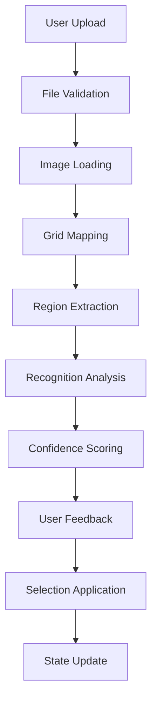

# Implementation Guide - Screenshot-Based Preset Recognition

This directory contains detailed implementation documentation for adding screenshot-based preset recognition to the Nova Drift Cheatsheet.

## 📋 Implementation Phases

### Core Development Phases
1. **[Image Upload & UX](Phase1-ImageUpload.md)** - File handling, drag-and-drop interface
2. **[Hex Grid Mapping](Phase2-HexMapping.md)** - Coordinate system and position mapping
3. **[Image Processing](Phase3-ImageProcessing.md)** - Canvas manipulation and region extraction
4. **[Recognition Logic](Phase4-Recognition.md)** - Selection state detection algorithms
5. **[System Integration](Phase5-Integration.md)** - Connecting with existing mod selection system
6. **[User Feedback](Phase6-UserFeedback.md)** - Results display and correction interface
7. **[Testing & Calibration](Phase7-Testing.md)** - Automated testing and threshold tuning
8. **[Documentation](Phase8-Documentation.md)** - User guides and technical documentation

## 🔧 Technical Stack

### Recommended Libraries
| Component | Library | Version | Purpose |
|-----------|---------|---------|---------|
| File Upload | Native File API + Custom | - | Lightweight, no dependencies |
| Hex Grid | [Honeycomb](https://github.com/flauwekeul/honeycomb) | ^4.1.5 | Hex coordinate systems |
| Image Processing | [Jimp](https://github.com/jimp-dev/jimp) | ^0.22.0 | Browser-based image manipulation |
| Canvas Utils | Native Canvas API + Fabric.js (optional) | - | Drawing and region extraction |
| Testing | [Vitest](https://vitest.dev/) | ^1.0.0 | Modern testing framework |
| UI Components | Native JS + CSS | - | Minimal dependencies |

### Architecture Principles
- **Zero Server Dependencies** - All processing client-side
- **Progressive Enhancement** - Works without new features
- **Modular Design** - Each phase is independently testable
- **Performance First** - Efficient canvas operations and lazy loading
- **Accessible** - Keyboard navigation and screen reader support

## 📊 Data Flow



## 🎯 Success Metrics

### Technical Targets
- **Accuracy:** >90% for high-quality screenshots
- **Performance:** <2s processing time for 1920x1080 images
- **Browser Support:** Chrome 90+, Firefox 90+, Safari 14+
- **File Size:** <50KB additional JavaScript payload
- **Memory:** <100MB peak usage during processing

### User Experience Goals
- **Ease of Use:** Single-click upload with immediate feedback
- **Error Recovery:** Clear error messages and correction options
- **Accessibility:** Full keyboard navigation and screen reader support
- **Mobile Support:** Touch-friendly interface for tablet use

## 🚀 Quick Start for Developers

### Prerequisites
```bash
# Ensure Haxe environment is set up
haxe --version  # Should show 4.x

# Install Node.js for testing tools
node --version  # Should show 18+
npm --version   # Should show 8+
```

### Development Setup
```bash
# 1. Install testing dependencies
npm init -y
npm install --save-dev vitest jsdom @vitest/ui

# 2. Copy sample test images
mkdir -p implementation/assets/test-screenshots

# 3. Run existing build process
haxe -lib csv -cp src -neko docs/gen.n -main Main
neko docs/gen.n
haxe -cp src -js docs/script.js -main WebMain
```

### Running Individual Phases
Each phase can be developed and tested independently:

```bash
# Test file upload functionality
npm run test -- Phase1

# Calibrate hex grid mapping
npm run test -- Phase2 --run-calibration

# Validate image processing
npm run test -- Phase3 --validate-regions

# Test recognition accuracy
npm run test -- Phase4 --accuracy-report
```

## 📁 Directory Structure

```
implementation/
├── README.md                   # This file
├── Phase1-ImageUpload.md       # File upload implementation
├── Phase2-HexMapping.md        # Grid coordinate mapping
├── Phase3-ImageProcessing.md   # Canvas and image analysis
├── Phase4-Recognition.md       # Selection detection logic
├── Phase5-Integration.md       # System integration
├── Phase6-UserFeedback.md      # User interface components
├── Phase7-Testing.md           # Testing and calibration
├── Phase8-Documentation.md     # Final documentation
├── assets/                     # Reference images and data
│   ├── reference-screenshots/  # Clean reference images
│   ├── test-screenshots/       # Test cases for validation
│   ├── hex-positions.json      # Coordinate mapping data
│   └── calibration-data.json   # Detection thresholds
├── modules/                    # Implementation modules
│   ├── upload-handler.js       # File upload logic
│   ├── hex-mapper.js           # Coordinate mapping
│   ├── image-processor.js      # Image manipulation
│   ├── recognition-engine.js   # Detection algorithms
│   ├── feedback-ui.js          # UI components
│   └── integration-layer.js    # System integration
└── tests/                      # Test suites
    ├── unit/                   # Unit tests for each module
    ├── integration/            # Cross-module integration tests
    ├── accuracy/               # Recognition accuracy validation
    └── performance/            # Performance benchmarks
```

## 🔗 Cross-Phase Dependencies

### Input/Output Chain
- **Phase 1 → Phase 2:** File object → Image element
- **Phase 2 → Phase 3:** Coordinate map → Region extraction parameters
- **Phase 3 → Phase 4:** Image regions → Recognition input data
- **Phase 4 → Phase 5:** Detection results → Selection application data
- **Phase 5 → Phase 6:** Applied state → Feedback display data
- **Phase 6 → Phase 7:** User corrections → Testing validation data

### Shared Resources
- **Configuration:** Threshold values, coordinate data, mod mappings
- **Utilities:** Image loading, coordinate conversion, state management
- **Error Handling:** Consistent error types and recovery strategies
- **Performance:** Shared Web Workers, canvas pooling, memory management

## 🧪 Testing Strategy

### Phase-by-Phase Validation
Each phase includes specific testing requirements:
- **Unit Tests:** Individual function validation
- **Integration Tests:** Cross-module compatibility
- **Performance Tests:** Memory and timing benchmarks
- **Accuracy Tests:** Recognition quality validation

### End-to-End Scenarios
- Screenshot upload to final selection application
- Error handling and recovery workflows
- Performance under various image conditions
- Accessibility compliance validation

## 📋 Implementation Checklist

### Pre-Development
- [ ] Review existing codebase and mod data structure
- [ ] Set up development environment with testing tools
- [ ] Collect reference screenshots for calibration
- [ ] Define success criteria and acceptance tests

### Development Phases
- [x] Phase 1: File upload and validation *(2-3 days)*
- [x] Phase 2: Hex grid coordinate mapping *(3-4 days)*
- [x] Phase 3: Image processing pipeline *(4-5 days)*
- [x] Phase 4: Recognition algorithms *(5-6 days)*
- [x] Phase 5: System integration *(2-3 days)*
- [x] Phase 6: User feedback interface *(3-4 days)*
- [x] Phase 7: Testing and calibration *(4-5 days)*
- [x] Phase 8: Documentation and deployment *(2-3 days)*

### Post-Development
- [ ] Performance optimization and benchmarking
- [ ] Cross-browser compatibility testing
- [ ] User acceptance testing with real screenshots
- [ ] Documentation review and update
- [ ] Deployment preparation and rollback strategy

---

## 🎉 Implementation Plan Complete

**Status:** All 8 phases documented and ready for development  
**Total Estimated Duration:** 25-30 days  
**Last Updated:** July 25, 2025

### Phase Completion Summary
✅ **Phase 1: Image Upload & UX** - Complete file upload interface with drag-and-drop  
✅ **Phase 2: Hex Grid Mapping** - Coordinate system and position mapping implementation  
✅ **Phase 3: Image Processing** - Canvas manipulation and region extraction pipeline  
✅ **Phase 4: Recognition Logic** - Advanced selection detection algorithms with confidence scoring  
✅ **Phase 5: System Integration** - Seamless integration with existing mod selection system  
✅ **Phase 6: User Feedback** - Interactive results display and correction interface  
✅ **Phase 7: Testing & Calibration** - Comprehensive testing framework and performance optimization  
✅ **Phase 8: Documentation & Deployment** - Complete documentation suite and deployment procedures  

### Key Deliverables Ready
- 📋 **Detailed Implementation Guides** - Step-by-step instructions for each phase
- 🔧 **Technical Architecture** - Modular design with clear dependencies
- 📊 **Performance Targets** - Specific metrics and success criteria
- 🧪 **Testing Strategy** - Comprehensive test coverage and validation procedures
- 📚 **Documentation Framework** - User guides, API docs, and maintenance procedures
- 🚀 **Deployment Plan** - Rollout strategy with monitoring and rollback procedures

### Next Steps for Development Team
1. **Environment Setup** - Follow Phase 1 prerequisites and tooling setup
2. **Sequential Development** - Implement phases 1-8 in order, using provided checklists
3. **Parallel Work Opportunities** - Phases 2-3 and 5-6 can be developed in parallel after Phase 1
4. **Quality Gates** - Use phase completion checklists and success criteria
5. **Documentation Updates** - Maintain documentation as implementation progresses

**Next Step:** Begin with [Phase 1: Image Upload & UX](Phase1-ImageUpload.md)
