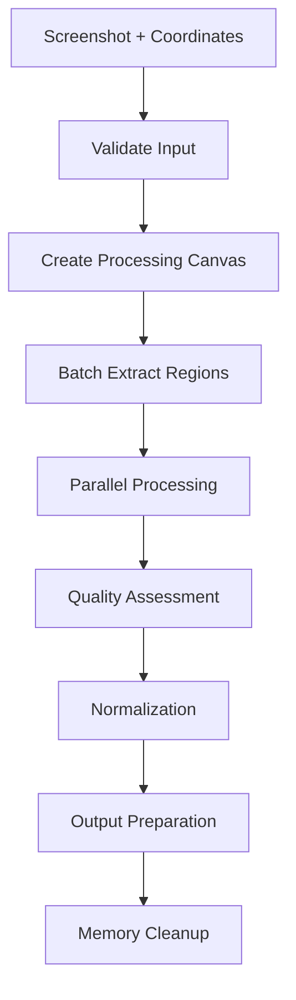

# Phase 3: Image Processing & Region Extraction Implementation

## 🎯 Mission
Implement efficient image processing to extract individual hex regions from screenshots based on coordinate mapping from Phase 2. The system must handle various image formats, resolutions, and quality levels while maintaining performance and accuracy.

## 📚 Required Reading
**Before starting, read these files to understand the context:**
1. `../implementation/Phase3-ImageProcessing.md` - Detailed Phase 3 specifications
2. Review Phase 2 implementation for coordinate mapping data
3. Study Canvas API documentation for image manipulation
4. Research Jimp library for browser-based image processing

## 🎯 Success Criteria
You must achieve ALL of these before Phase 3 is considered complete:

- ✅ Extract 48x48px hex regions from any screenshot resolution
- ✅ Process 4K screenshots in under 3 seconds
- ✅ Maintain image quality for recognition accuracy
- ✅ Handle edge cases (partial hexes, overlays, poor quality)
- ✅ Memory-efficient processing (<100MB peak usage)
- ✅ Batch processing optimization for multiple regions
- ✅ Error recovery for corrupted or unusual images

## 🔧 Technical Requirements

### Input from Phase 2
```javascript
{
  type: 'grid-mapped',
  detail: {
    imageElement: HTMLImageElement,
    coordinateMap: Map<string, CoordinateData>,
    scalingFactor: number,
    boundingBox: Rectangle,
    confidence: number,
    referencePoints: Array<Point>,
    gridMetadata: {
      hexRadius: number,
      gridCenter: Point,
      totalDetectedHexes: number,
      resolution: { width: number, height: number }
    }
  }
}
```

### Output for Phase 4
```javascript
{
  type: 'regions-extracted',
  detail: {
    regionData: Map<string, {
      modName: string,
      imageData: ImageData,        // 48x48 normalized hex region
      originalBounds: Rectangle,   // Original screenshot coordinates
      extractionMetadata: {
        quality: number,           // Image quality score (0-1)
        completeness: number,      // How complete the hex is (0-1)
        confidence: number,        // Extraction confidence (0-1)
        timestamp: number
      }
    }>,
    processingMetadata: {
      totalRegions: number,
      successfulExtractions: number,
      averageQuality: number,
      processingTime: number,
      memoryUsage: number
    }
  }
}
```

## 🔧 Core Processing Components

### 1. ImageProcessor Class
```javascript
class ImageProcessor {
  constructor(options = {}) {
    this.targetSize = { width: 48, height: 48 };
    this.qualityThreshold = 0.7;
    this.canvas = document.createElement('canvas');
    this.ctx = this.canvas.getContext('2d');
    this.workerPool = new WorkerPool(options.maxWorkers || 4);
  }
  
  async extractRegions(imageElement, coordinateMap) {
    // Main extraction logic
  }
}
```

### 2. RegionExtractor Class
```javascript
class RegionExtractor {
  extractHexRegion(sourceImage, centerPoint, hexRadius) {
    // Extract individual hex region with proper bounds
  }
  
  normalizeRegion(imageData, targetSize) {
    // Resize and normalize to standard 48x48
  }
  
  assessQuality(imageData) {
    // Analyze image quality for recognition suitability
  }
}
```

### 3. QualityAnalyzer Class
```javascript
class QualityAnalyzer {
  analyzeImageQuality(imageData) {
    // Assess sharpness, contrast, noise levels
  }
  
  calculateCompleteness(imageData, expectedShape) {
    // Determine if hex region is complete or partially cropped
  }
  
  detectArtifacts(imageData) {
    // Identify compression artifacts, overlays, UI elements
  }
}
```

## 🎨 Image Processing Pipeline

### Processing Workflow


### Extraction Algorithm
1. **Calculate extraction bounds** from hex center and radius
2. **Create temporary canvas** for region extraction
3. **Draw source region** to canvas with proper scaling
4. **Resize to standard dimensions** (48x48px)
5. **Apply quality enhancement** (sharpening, contrast)
6. **Assess extraction quality** and completeness
7. **Package for recognition phase**

## 🚀 Performance Optimization

### Memory Management
```javascript
class MemoryManager {
  constructor() {
    this.canvasPool = [];
    this.maxPoolSize = 8;
    this.memoryMonitor = new MemoryMonitor();
  }
  
  getCanvas(width, height) {
    // Reuse canvas objects to prevent memory leaks
  }
  
  releaseCanvas(canvas) {
    // Return canvas to pool for reuse
  }
  
  cleanup() {
    // Force garbage collection when needed
  }
}
```

### Batch Processing
- Process multiple regions in parallel using Web Workers
- Implement intelligent batching based on system resources
- Use canvas pooling to reduce object creation overhead
- Monitor memory usage and implement backpressure

### Quality vs Speed Trade-offs
```javascript
const PROCESSING_MODES = {
  FAST: {
    maxWorkers: 2,
    qualityEnhancement: false,
    resamplingAlgorithm: 'linear'
  },
  BALANCED: {
    maxWorkers: 4,
    qualityEnhancement: true,
    resamplingAlgorithm: 'bicubic'
  },
  QUALITY: {
    maxWorkers: 6,
    qualityEnhancement: true,
    resamplingAlgorithm: 'lanczos'
  }
};
```

## 🔧 Implementation Details

### Canvas-Based Extraction
```javascript
extractHexRegion(sourceImage, centerPoint, hexRadius) {
  const size = hexRadius * 2.5; // Include padding for rotation
  const canvas = this.memoryManager.getCanvas(size, size);
  const ctx = canvas.getContext('2d');
  
  // Clear and set up canvas
  ctx.clearRect(0, 0, size, size);
  ctx.imageSmoothingEnabled = true;
  ctx.imageSmoothingQuality = 'high';
  
  // Extract region with center positioning
  const sourceX = centerPoint.x - size / 2;
  const sourceY = centerPoint.y - size / 2;
  
  ctx.drawImage(sourceImage, sourceX, sourceY, size, size, 0, 0, size, size);
  
  // Get image data for further processing
  return ctx.getImageData(0, 0, size, size);
}
```

### Quality Enhancement
```javascript
enhanceImageQuality(imageData) {
  const enhanced = new ImageData(imageData.width, imageData.height);
  const data = imageData.data;
  const enhancedData = enhanced.data;
  
  // Apply unsharp mask for clarity
  this.applyUnsharpMask(data, enhancedData, imageData.width, imageData.height);
  
  // Enhance contrast
  this.enhanceContrast(enhancedData, 1.2);
  
  // Reduce noise while preserving edges
  this.adaptiveDenoising(enhancedData, imageData.width, imageData.height);
  
  return enhanced;
}
```

## 🧪 Testing Requirements

### Performance Testing
```javascript
const performanceTests = [
  {
    name: 'Small screenshot (1920x1080)',
    expectedTime: 1000, // ms
    expectedMemory: 50 * 1024 * 1024, // 50MB
  },
  {
    name: 'Large screenshot (3840x2160)',
    expectedTime: 3000, // ms
    expectedMemory: 100 * 1024 * 1024, // 100MB
  },
  {
    name: 'Batch processing (50 regions)',
    expectedTime: 2000, // ms
    expectedMemory: 75 * 1024 * 1024, // 75MB
  }
];
```

### Quality Testing
- [ ] Verify 48x48 output dimensions for all extractions
- [ ] Test quality assessment accuracy with known good/bad regions
- [ ] Validate completeness detection for partial hexes
- [ ] Check enhancement algorithms don't introduce artifacts
- [ ] Test memory cleanup prevents leaks

### Edge Case Testing
- [ ] Corrupted or unusual image formats
- [ ] Extremely small or large source images
- [ ] Screenshots with overlays or UI elements
- [ ] Low quality/compressed source images
- [ ] Partial hex regions at screenshot edges

## 🔗 Integration Specifications

### Event Handling
```javascript
document.addEventListener('grid-mapped', async (event) => {
  const processor = new ImageProcessor({
    targetSize: { width: 48, height: 48 },
    qualityThreshold: 0.7,
    maxWorkers: 4
  });
  
  try {
    const extractionResult = await processor.extractRegions(
      event.detail.imageElement,
      event.detail.coordinateMap
    );
    
    // Dispatch for Phase 4
    document.dispatchEvent(new CustomEvent('regions-extracted', {
      detail: extractionResult
    }));
  } catch (error) {
    console.error('Region extraction failed:', error);
    // Handle error appropriately
  }
});
```

### Error Handling
- **Memory exhaustion**: Implement graceful degradation
- **Canvas errors**: Fallback to alternative processing methods
- **Invalid coordinates**: Skip problematic regions with logging
- **Timeout protection**: Prevent infinite processing loops

## 💡 Advanced Features

### Adaptive Processing
- Detect system capabilities and adjust worker count
- Monitor performance and switch processing modes
- Implement progressive enhancement based on available resources

### Quality Optimization
- Use different algorithms based on source image characteristics
- Implement AI-assisted quality enhancement (future Phase 4 integration)
- Provide user controls for quality vs speed preferences

## 🔧 Code Organization
```
docs/
├── image-processing/
│   ├── image-processor.js     # Main processing orchestrator
│   ├── region-extractor.js    # Individual region extraction
│   ├── quality-analyzer.js    # Image quality assessment
│   ├── memory-manager.js      # Memory and resource management
│   ├── worker-pool.js         # Web worker management
│   └── processing-utils.js    # Utility functions
└── workers/
    └── extraction-worker.js   # Web worker for parallel processing
```

## 📝 Completion Checklist

Before moving to Phase 4, ensure:
- [ ] All success criteria are met
- [ ] Performance targets achieved for all test cases
- [ ] Memory usage stays within limits
- [ ] Quality assessment algorithms working properly
- [ ] Batch processing optimized and tested
- [ ] Error handling comprehensive and tested
- [ ] Integration with Phase 2 working smoothly
- [ ] Output format properly prepared for Phase 4
- [ ] Code well-documented with performance notes
- [ ] Memory leaks prevented and tested

**When complete, you're ready for Phase 4: Recognition Logic & Selection Detection!** 🎉
