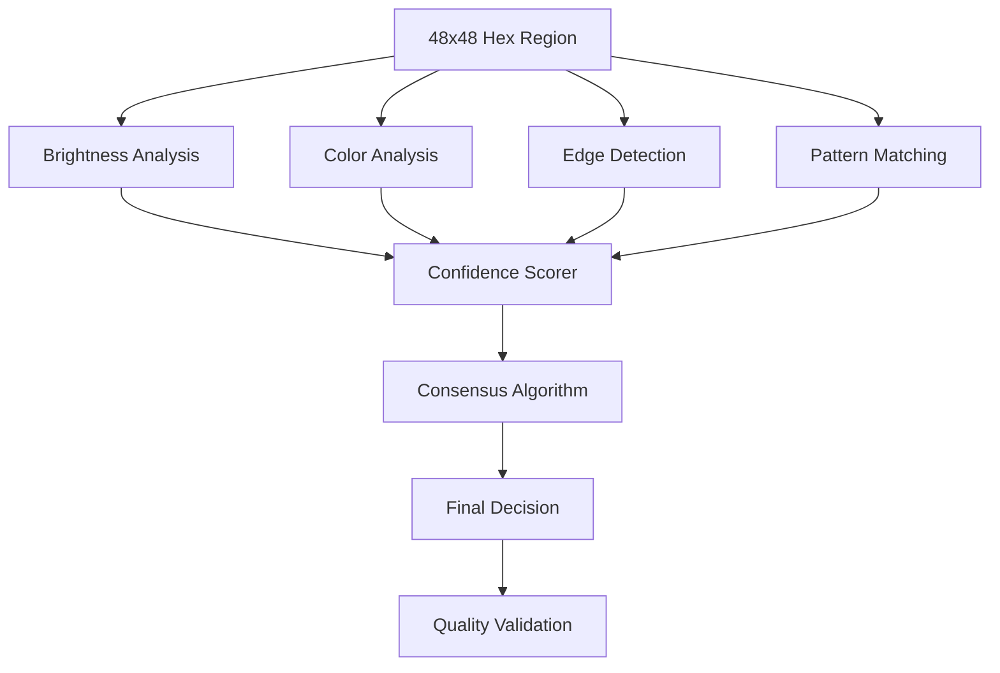

# Phase 4: Recognition Logic & Selection Detection Implementation

## 🎯 Mission
Implement the core recognition algorithms that analyze extracted hex regions to determine whether each mod is selected or unselected. The system uses multiple detection methods with confidence scoring to provide robust and accurate results.

## 📚 Required Reading
**Before starting, read these files to understand the context:**
1. `../implementation/Phase4-Recognition.md` - Detailed Phase 4 specifications
2. Review Phase 3 implementation for extracted region data
3. Study Nova Drift mod selection visual patterns
4. Research computer vision techniques for binary classification

## 🎯 Success Criteria
You must achieve ALL of these before Phase 4 is considered complete:

- ✅ Achieve >90% accuracy on high-quality screenshots
- ✅ Handle various game themes and UI states
- ✅ Provide confidence scores for each detection
- ✅ Process all regions in under 2 seconds
- ✅ Graceful handling of edge cases and ambiguous states
- ✅ Multi-algorithm fusion for robust detection
- ✅ Calibration system for threshold optimization

## 🔧 Technical Requirements

### Input from Phase 3
```javascript
{
  type: 'regions-extracted',
  detail: {
    regionData: Map<string, {
      modName: string,
      imageData: ImageData,        // 48x48 normalized hex region
      originalBounds: Rectangle,
      extractionMetadata: {
        quality: number,
        completeness: number,
        confidence: number,
        timestamp: number
      }
    }>,
    processingMetadata: {
      totalRegions: number,
      successfulExtractions: number,
      averageQuality: number,
      processingTime: number
    }
  }
}
```

### Output for Phase 5
```javascript
{
  type: 'selection-detected',
  detail: {
    detectionResults: Map<string, {
      modName: string,
      selected: boolean,
      confidence: number,           // Overall confidence (0-1)
      analysisData: {
        brightness: { value: number, confidence: number },
        color: { value: number, confidence: number },
        edge: { value: number, confidence: number },
        pattern: { value: number, confidence: number },
        consensus: number           // Multi-algorithm consensus
      },
      metadata: {
        processingTime: number,
        quality: number,
        ambiguous: boolean,         // Flagged for manual review
        timestamp: number
      }
    }>,
    overallStats: {
      totalAnalyzed: number,
      highConfidence: number,       // Confidence > 0.8
      mediumConfidence: number,     // Confidence 0.5-0.8
      lowConfidence: number,        // Confidence < 0.5
      averageConfidence: number,
      processingTime: number,
      algorithmPerformance: Map<string, number>
    }
  }
}
```

## 🔍 Recognition Algorithm Architecture

### Multi-Method Detection Strategy


## 🧠 Core Recognition Algorithms

### 1. Brightness-Based Detection
```javascript
class BrightnessDetector {
  constructor(thresholds = {}) {
    this.thresholds = {
      selectedMin: 0.7,        // Selected hexes are brighter
      unselectedMax: 0.4,      // Unselected hexes are dimmer
      ambiguousRange: 0.3,     // Confidence reduction zone
      ...thresholds
    };
  }
  
  analyze(imageData) {
    const brightness = this.calculateAverageBrightness(imageData);
    const distribution = this.analyzeBrightnessDistribution(imageData);
    const confidence = this.calculateConfidence(brightness, distribution);
    
    return {
      selected: brightness > this.thresholds.selectedMin,
      brightness: brightness,
      confidence: confidence,
      distribution: distribution
    };
  }
  
  calculateAverageBrightness(imageData) {
    // Weighted brightness calculation considering hex shape
  }
  
  analyzeBrightnessDistribution(imageData) {
    // Analyze brightness histogram for selection patterns
  }
}
```

### 2. Color-Based Detection
```javascript
class ColorDetector {
  constructor() {
    this.selectedColorProfiles = this.loadSelectedColorProfiles();
    this.unselectedColorProfiles = this.loadUnselectedColorProfiles();
  }
  
  analyze(imageData) {
    const dominantColors = this.extractDominantColors(imageData);
    const colorProfile = this.buildColorProfile(dominantColors);
    const selectedScore = this.matchColorProfile(colorProfile, this.selectedColorProfiles);
    const unselectedScore = this.matchColorProfile(colorProfile, this.unselectedColorProfiles);
    
    return {
      selected: selectedScore > unselectedScore,
      colorProfile: colorProfile,
      selectedScore: selectedScore,
      unselectedScore: unselectedScore,
      confidence: Math.abs(selectedScore - unselectedScore)
    };
  }
  
  extractDominantColors(imageData) {
    // K-means clustering for dominant color extraction
  }
  
  matchColorProfile(profile, referenceProfiles) {
    // Calculate similarity to known selection/unselection patterns
  }
}
```

### 3. Edge Detection Algorithm
```javascript
class EdgeDetector {
  constructor() {
    this.sobelX = [-1, 0, 1, -2, 0, 2, -1, 0, 1];
    this.sobelY = [-1, -2, -1, 0, 0, 0, 1, 2, 1];
  }
  
  analyze(imageData) {
    const edges = this.detectEdges(imageData);
    const edgeProfile = this.analyzeEdgeProfile(edges);
    const selectionIndicators = this.identifySelectionEdges(edgeProfile);
    
    return {
      selected: selectionIndicators.hasSelectionBorder,
      edgeStrength: edgeProfile.averageStrength,
      borderQuality: selectionIndicators.borderQuality,
      confidence: selectionIndicators.confidence
    };
  }
  
  detectEdges(imageData) {
    // Sobel edge detection with hex-aware masking
  }
  
  identifySelectionEdges(edgeProfile) {
    // Detect characteristic selection border patterns
  }
}
```

### 4. Pattern Matching Algorithm
```javascript
class PatternMatcher {
  constructor() {
    this.selectionTemplates = this.loadSelectionTemplates();
    this.correlationThreshold = 0.8;
  }
  
  analyze(imageData) {
    const bestMatch = this.findBestTemplate(imageData);
    const rotationAdjustedMatch = this.tryRotations(imageData, bestMatch);
    
    return {
      selected: rotationAdjustedMatch.correlation > this.correlationThreshold,
      templateId: rotationAdjustedMatch.templateId,
      correlation: rotationAdjustedMatch.correlation,
      rotation: rotationAdjustedMatch.rotation,
      confidence: rotationAdjustedMatch.correlation
    };
  }
  
  findBestTemplate(imageData) {
    // Template matching with normalized cross-correlation
  }
  
  tryRotations(imageData, template) {
    // Account for slight rotation variations in screenshots
  }
}
```

## 🔄 Consensus Algorithm

### Multi-Algorithm Fusion
```javascript
class ConsensusEngine {
  constructor(algorithmWeights = {}) {
    this.weights = {
      brightness: 0.3,
      color: 0.25,
      edge: 0.25,
      pattern: 0.2,
      ...algorithmWeights
    };
  }
  
  calculateConsensus(algorithmResults) {
    const weightedVotes = this.calculateWeightedVotes(algorithmResults);
    const confidence = this.calculateOverallConfidence(algorithmResults);
    const agreement = this.calculateAgreement(algorithmResults);
    
    return {
      selected: weightedVotes > 0.5,
      confidence: confidence * agreement,
      weightedVotes: weightedVotes,
      agreement: agreement,
      algorithmResults: algorithmResults
    };
  }
  
  calculateWeightedVotes(results) {
    // Weight each algorithm's vote by its confidence and predefined weight
  }
  
  calculateAgreement(results) {
    // Measure how much algorithms agree with each other
  }
}
```

## 🎛️ Calibration System

### Adaptive Threshold Optimization
```javascript
class CalibrationSystem {
  constructor() {
    this.userCorrections = new Map();
    this.performanceMetrics = new Map();
  }
  
  recordUserCorrection(modName, actualSelection, detectedSelection, confidence) {
    // Store user corrections for threshold optimization
  }
  
  optimizeThresholds() {
    // Use accumulated corrections to improve detection accuracy
  }
  
  validateCalibration(testSet) {
    // Test current thresholds against known correct data
  }
}
```

### Real-time Performance Monitoring
```javascript
class PerformanceMonitor {
  trackDetectionAccuracy(predictions, groundTruth) {
    // Monitor accuracy in real-time
  }
  
  identifyProblematicCases() {
    // Flag consistently difficult detection cases
  }
  
  suggestThresholdAdjustments() {
    // Recommend threshold changes based on performance data
  }
}
```

## 🧪 Testing Requirements

### Accuracy Testing
```javascript
const accuracyTests = [
  {
    name: 'High quality screenshots',
    testSet: 'test-data/high-quality/',
    expectedAccuracy: 0.95,
    minConfidence: 0.8
  },
  {
    name: 'Medium quality screenshots',
    testSet: 'test-data/medium-quality/',
    expectedAccuracy: 0.85,
    minConfidence: 0.6
  },
  {
    name: 'Challenging cases',
    testSet: 'test-data/challenging/',
    expectedAccuracy: 0.75,
    minConfidence: 0.4
  }
];
```

### Performance Testing
- [ ] Process 50 regions in under 2 seconds
- [ ] Memory usage stable during batch processing
- [ ] Algorithm performance consistent across different image qualities
- [ ] Calibration system improves accuracy over time

### Edge Case Testing
- [ ] Ambiguous selections (partially selected appearance)
- [ ] Corrupted or artifacts in hex regions
- [ ] Unusual color schemes or themes
- [ ] Very low quality or compressed images
- [ ] Overlays or UI elements obscuring hexes

## 🔗 Integration Specifications

### Event Handling
```javascript
document.addEventListener('regions-extracted', async (event) => {
  const recognitionEngine = new RecognitionEngine({
    algorithms: ['brightness', 'color', 'edge', 'pattern'],
    consensusThreshold: 0.6,
    calibrationEnabled: true
  });
  
  try {
    const detectionResult = await recognitionEngine.analyzeRegions(
      event.detail.regionData
    );
    
    // Dispatch for Phase 5
    document.dispatchEvent(new CustomEvent('selection-detected', {
      detail: detectionResult
    }));
  } catch (error) {
    console.error('Recognition failed:', error);
    // Handle error appropriately
  }
});
```

### Quality Assurance
- **Confidence thresholds**: Flag low-confidence detections for review
- **Consensus requirements**: Require algorithm agreement for high confidence
- **Fallback strategies**: Manual review for ambiguous cases
- **Performance monitoring**: Track and improve accuracy over time

## 💡 Advanced Features

### Machine Learning Integration (Future)
```javascript
// Commented ML integration for future enhancement
class MLEnhancedDetector {
  constructor() {
    // this.model = null;
    // this.isModelLoaded = false;
  }
  
  async loadModel() {
    // Future: Load TensorFlow.js model
    // this.model = await tf.loadLayersModel('/models/hex-recognition.json');
    // this.isModelLoaded = true;
  }
  
  analyze(imageData) {
    // Future: ML-based detection
    // const tensor = tf.browser.fromPixels(imageData);
    // const prediction = this.model.predict(tensor);
    // return prediction;
  }
}
```

### Data Collection for Future Training
```javascript
class DataCollectionService {
  collectTrainingData(imageData, userCorrection, confidence) {
    // Store for future model training
    const trainingExample = {
      imageData: this.serializeImageData(imageData),
      label: userCorrection,
      metadata: {
        confidence: confidence,
        timestamp: Date.now(),
        userAgent: navigator.userAgent
      }
    };
    
    this.storeTrainingExample(trainingExample);
  }
}
```

## 🔧 Code Organization
```
docs/
├── recognition-engine/
│   ├── recognition-engine.js      # Main orchestrator
│   ├── brightness-detector.js     # Brightness analysis
│   ├── color-detector.js          # Color profile analysis
│   ├── edge-detector.js           # Edge detection algorithms
│   ├── pattern-matcher.js         # Template matching
│   ├── consensus-engine.js        # Multi-algorithm fusion
│   ├── calibration-system.js      # Threshold optimization
│   ├── performance-monitor.js     # Real-time monitoring
│   └── recognition-utils.js       # Utility functions
└── recognition-data/
    ├── color-profiles.js          # Reference color data
    ├── selection-templates.js     # Pattern templates
    └── calibration-data.js        # Threshold configurations
```

## 📝 Completion Checklist

Before moving to Phase 5, ensure:
- [ ] All success criteria are met
- [ ] Recognition accuracy tested and validated
- [ ] All four detection algorithms implemented and working
- [ ] Consensus engine providing reliable results
- [ ] Confidence scoring accurate and meaningful
- [ ] Calibration system functional
- [ ] Performance targets met (sub-2 second processing)
- [ ] Edge cases handled gracefully
- [ ] Integration with Phase 3 working smoothly
- [ ] Output format properly prepared for Phase 5
- [ ] Code well-documented with algorithm explanations
- [ ] Test suite comprehensive and passing

**When complete, you're ready for Phase 5: System Integration!** 🎉
